# 微服务如何进行数据库管理

## 分布式数据管理之痛点

为了确保微服务之间松耦合，每个服务都有自己的数据库, 有的是关系型数据库(SQL)，有的是非关系型数据库(NoSQL)。开发企业事务往往牵涉到多个服务，要想做到多个服务数据的一致性并非易事，同样，在多个服务之间进行数据查询也充满挑战。我们以一个在线 B2B 商店为例，客户服务包括了客户的各种信息，例如可用信用等。管理订单，提供订单服务，则需要验证某个新订单与客户的信用限制没有冲突。在单体应用中，订单服务只需要使用传统事务交易就可以一次性检查可用信用和创建订单。相反微服务架构下，订单和客户表分别是相应服务的私有表，如下图所示：

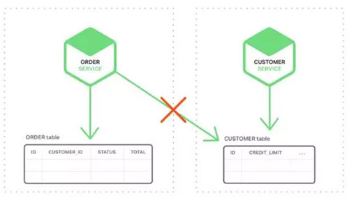

订单服务不能直接访问客户表，只能通过客户服务发布的 API 来访问或者使用分布式事务, 也就是众所周知的两阶段提交 (2PC)来访问客户表，2PC 意义图如下所示：

这里存在两个挑战：

1. 第一个挑战是 2PC 除要求数据库本身支持外，还要求服务的数据库类型需要保持一致。但是现在的微服务架构中，每个服务的数据库类型可能是不一样的，有的可能是 MySQL 数据库，有的也可能是 NoSQL 数据库;
2. 第二个挑战是如何实现从多个服务中查询数据。假设应用程序需要显示一个客户和他最近的订单。如果订单服务提供用于检索客户订单的 API，那么应用程序端可以通过 JOIN 方式来检索此数据，即应用程序首选从客户服务检索客户，并从订单服务检索客户的订单。然而，如果订单服务仅支持通过其主键查找订单(也许它使用仅支持基于主键的检索的 NoSQL 数据库)， 在这种情况下，就没有方法来检索查询所需的数据。

为解决这两大痛点，就需要我们使用到分步式数据管理了。

## 分布式数据管理之举措

在介绍分布式数据管理(CRUD)解决方案之前，有必要介绍下 CAP 原理和最终一致性相关概念。

## CAP 原理(CAP Theorem)

在足球比赛里，一个球员在一场比赛中进三个球，称之为帽子戏法(Hat-trick)。在分布式数据系统中，也有一个帽子原理(CAP Theorem)，不过此帽子非彼帽子。CAP 原理中，有三个要素：

1. 一致性(C onsistency)
2. 可用性(A vailability)
3. 分区容忍性(P artition tolerance)

CAP 原理指的是，这三个要素最多只能同时实现两点，不可能三者兼顾。

因此在进行分布式架构设计时，必须做出取舍。而对于分布式数据系统，分区容忍性是基本要求 ，否则就失去了价值，因此设计分布式数据系统，就是在一致性和可用性之间取一个平衡。

对于大多数 WEB 应用，其实并不需要强一致性，因此牺牲一致性而换取高可用性，是目前多数分布式数据库产品的方向。

当然，牺牲一致性，并不是完全不管数据的一致性，否则数据是混乱的，那么系统可用性再高分布式再好也没有了价值。

牺牲一致性，只是不再要求关系型数 据库中的强一致性，而是只要系统能达到最终一致性即可，考虑到客户体验，这个最终一致的时间窗口，要尽可能的对用户透明，也就是需要保障“用户感知到的一致性”。

通常是通过数据的多份异步复制来实现系统的高可用和数据的最终一致性的，“用户感知到的一致性”的时间窗口则 取决于数据复制到一致状态的时间。

## 最终一致性(eventually consistent)

对于一致性，可以分为从客户端和服务端两个不同的视角。

从客户端来看，一致性主要指的是多并发访问时更新过的数据如何获取的问题。

从服务端来看，则是更新如何复制分布到整个系统，以保证数据最终一致。

一致性是因为有并发读写才有的问题，因此在理解一致性的问题时，一定要注意结合考虑并发读写的场景。

从客户端角度，多进程并发访问时，更新过的数据在不同进程如何获取的不同策略，决定了不同的一致性。

对于关系型数据库，要求更新过的数据能被后续的 访问都能看到，这是强一致性 ;如果能容忍后续的部分或者全部访问不到，则是弱一致性 ; 如果经过一段时间后要求能访问到更新后的数据，则是最终一致性。

从服务端角度，如何尽快将更新后的数据分布到整个系统，降低达到最终一致性的时间窗口，是提高系统的可用度和用户体验非常重要的方面。

那么问题来了，如何实现数据的最终一致性呢?答案就在事件驱动架构。

## 事件驱动架构简介

Chris Richardson 作为微服务架构设计领域的权威，给出了分布式数据管理的最佳解决方案。

对于大多数应用而言，要实现微服务的分布式数据管理，需要采用事件驱动架构(event-driven architecture)。

在事件驱动架构中，当某件重要事情发生时，微服务会发布一个事件，例如更新一个业务实体。

当订阅这些事件的微服务接收此事件时，就可以更新自己的业务实体，也可能会引发更多的事件发布，让其他相关服务进行数据更新，最终实现分布式数据最终一致性。

可以使用事件来实现跨多服务的业务交易。交易一般由一系列步骤构成，每一步骤都由一个更新业务实体的微服务和发布激活下一步骤的事件构成。

### 事件驱动示例 1

下图展现如何使用事件驱动方法，在创建订单时检查信用可用度，微服务之间通过消息代理(Messsage Broker)来交换事件。

- 订单服务创建一个带有 NEW 状态的 Order (订单)，发布了一个“Order Created Event(创建订单)”的事件。

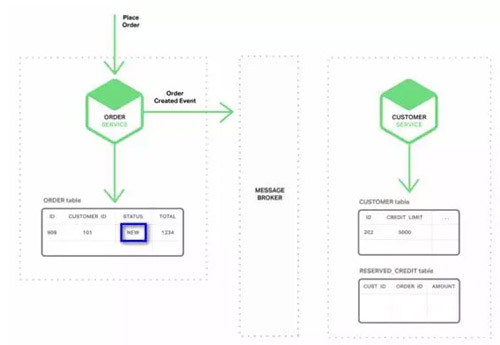

- 客户服务消费 Order Created Event 事件，为此订单预留信用，发布“Credit Reserved Event(信用预留)”事件。

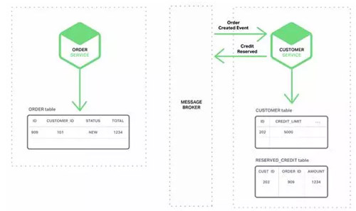

- 订单服务消费 Credit Reserved Event，改变订单的状态为 OPEN。

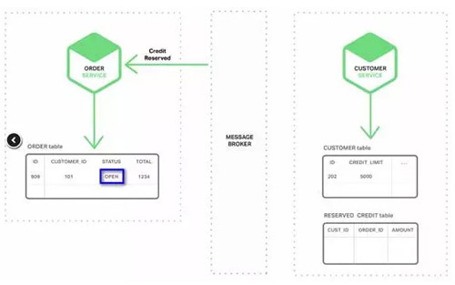

### 事件驱动示例 2

下图展现如何使用事件驱动方法，在创建订单时触发支付业务的数据更新，微服务之间通过消息代理(Messsage Broker)来交换事件。

- 订单服务创建一个待支付的订单，发布一个“创建订单”的事件。

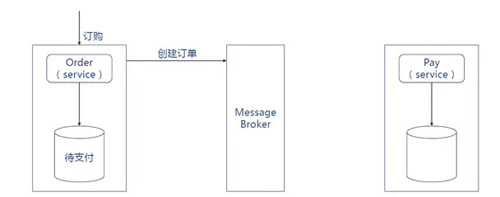

- 支付服务消费“创建订单”事件，支付完成后发布一个“支付完成”事件。

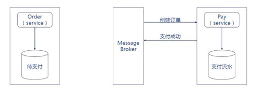

- 订单服务消费“支付完成”事件，订单状态更新为待出库。

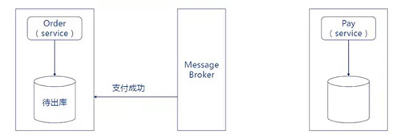

## 事件驱动架构之分布式数据更新

上节通过示例概要介绍了通过事件驱动方式，实现了分布式数据最终一致性保证。纵观微服务架构下的事件驱动业务处理逻辑，其核心要点在于，可靠的事件投递和避免事件的重复消费。

可靠事件投递有以下两个特性：

1. 每个服务原子性的完成业务操作和发布事件;
2. 消息代理确保事件投递至少一次(at least once);

而避免事件重复消费则要求消费事件的服务实现幂等性，比如支付服务不能因为重复收到事件而多次支付。

BTW：当前流行的消息队列如Kafka等，都已经实现了事件的持久化和at least once的投递模式，所以可靠事件投递的第二条特性已经满足，这里就不展开。接下来章节讲重点讲述如何实现可靠事件投递的第一条特性和避免事件重复消费，即服务的业务操作和发布事件的原子性和避免消费者重复消费事件要求服务实现幂等性。

### 如何实现事件投递操作原子性?

事件驱动架构会碰到数据库更新和发布事件原子性问题。例如，订单服务必须向 ORDER 表插入一行，然后发布 Order Created event，这两个操作需要原子性。比如更新数据库后，服务瘫了(crashes)造成事件未能发布，系统变成不一致状态。那么如何实现服务的业务操作和发布事件的原子性呢?

- **使用本地事务发布事件**

获得原子性的一个方法是将服务的业务操作和发布事件放在一个本地数据库事务里，也就是说，需要在本地建立一个 EVENT 表，此表在存储业务实体数据库中起到消息列表功能。当应用发起一个(本地)数据库交易，更新业务实体状态时，会向 EVENT 表中插入一个事件，然后提交此次交易。另外一个独立应用进程或者线程查询此 EVENT 表，向消息代理发布事件，然后使用本地交易标志此事件为已发布，如下图所示：

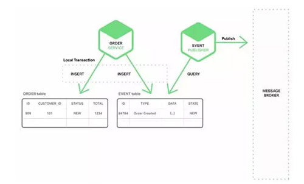

订单服务向 ORDER 表插入一行，然后向 EVENT 表中插入 Order Created event，事件发布线程或者进程查询 EVENT 表，请求未发布事件，发布他们，然后更新 EVENT 表标志此事件为已发布。

此方法也是优缺点都有。优点是可以确保事件发布不依赖于 2PC，应用发布业务层级事件而不需要推断他们发生了什么;而缺点在于此方法由于开发人员必须牢记发布事件，因此有可能出现错误。

- **使用事件源**

Event sourcing (事件源)通过使用以事件中心的数据存储方式来保证业务实体的一致性。事件源保存了每个业务实体所有状态变化的事件，而不是存储实体当前的状态。应用可以通过重放事件来重建实体现在的状态。只要业务实体发生变化，新事件就会添加到事件表中。因为保存事件是单一操作，因此肯定是原子性的。

为了理解事件源工作方式，考虑以事件实体作为一个例子说明。传统方式中，每个订单映射为 ORDER 表中一行。但是对于事件源方式，订单服务以事件状态改变方式存储一个订单：创建的，已批准的，已发货的，取消的;每个事件包括足够信息来重建订单的状态。

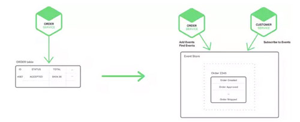

事件源方法有很多优点：解决了事件驱动架构关键问题，使得业务实体更新和事件发布原子化，但是也存在缺点，因为是持久化事件而不是对象，导致数据查询时，必须使用 Command Query Responsibility Segregation (CQRS) 来完成查询业务，从开发角度看，存在一定挑战。

### 如何避免事件重复消费?

要避免事件重复消费，需要消费事件的服务实现服务幂等，因为存在重试和错误补偿机制，不可避免的在系统中存在重复收到消息的场景，服务幂等能提高数据的一致性。在编程中,一个幂等操作的特点是其任意多次执行所产生的影响均与一次执行的影响相同，因此需要开发人员在功能设计实现时，需要特别注意服务的幂等性。

## 事件驱动架构之分布式数据查询

微服务架构下，由于分布式数据库的存在，导致在执行用户业务数据查询时，通常需要跨多个微服务数据库进行数据查询，也就是分布式数据查询。那么问题来了，由于每个微服务的数据都是私有化的，只能通过各自的REST接口获取，如果负责业务查询的功能模块，通过调用各个微服务的REST接口来分别获取基础数据，然后在内存中再进行业务数据拼装后，再返回给用户。该方法无论从程序设计或是查询性能角度看，都不是一个很好的方法。那么如何解决微服务架构下的分布式数据查询问题呢? 在给出解决方案之前，需要读者首先了解下物化视图和命令查询职责分离等相关概念。

### 什么是物化视图(merialized views)?

物化视图是包括一个查询结果的数据库对像，它是远程数据的的本地副本，或者用来生成基于数据表求和的汇总表。物化视图存储基于远程表的数据，也可以称为快照。这个基本上就说出了物化视图的本质，它是一组查询的结果，这样势必为将来再次需要这组数据时大大提高查询性能。物化视图有两种刷新模式 ON DEMAND 和 ON COMMIT，用户可根据实际情况进行设置。

物化视图对于应用层是透明的，不需要有任何的改动，终端用户甚至都感觉不到底层是用的物化视图。总之，使用物化视图的目的一个是提高查询性能，另一个是由于物化视图包含的数据是远程数据库的数据快照或拷贝，微服务可通过物化视图和命令查询职责分离(CQRS)技术(参见以下章节)实现分布式数据查询。

### 什么是命令查询职责分离(CQRS)?

在常用的单体应用架构中，通常都是通过数据访问层来修改或者查询数据，一般修改和查询使用的是相同的实体。在一些业务逻辑简单的系统中可能没有什么问题，但是随着系统逻辑变得复杂，用户增多，这种设计就会出现一些性能问题;另外更重要的是，在微服务架构下，通常需要跨多个微服务数据库来查询数据，此时，我们可借助命令查询职责分离(CQRS)来有效解决这些问题。

CQRS 使用分离的接口将数据查询操作(Queries)和数据修改操作(Commands)分离开来，这也意味着在查询和更新过程中使用的数据模型也是不一样的。这样读和写逻辑就隔离开来了。使用 CQRS 分离了读写职责之后，可以对数据进行读写分离操作来改进性能，同时提高可扩展性和安全。如下图：

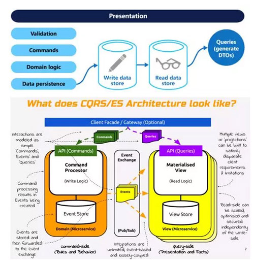

主数据库处理 CUD，从库处理 R，从库的的结构可以和主库的结构完全一样，也可以不一样，从库主要用来进行只读的查询操作。在数量上从库的个数也可以根据查询的规模进行扩展，在业务逻辑上，也可以根据专题从主库中划分出不同的从库。从库也可以实现成 ReportingDatabase，根据查询的业务需求，从主库中抽取一些必要的数据生成一系列查询报表来存储。

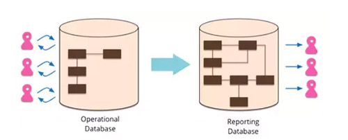

使用 ReportingDatabase 的一些优点通常可以使得查询变得更加简单高效：

- ReportingDatabase 的结构和数据表会针对常用的查询请求进行设计。
- ReportingDatabase 数据库通常会去正规化，存储一些冗余而减少必要的 Join 等联合查询操作，使得查询简化和高效，一些在主数据库中用不到的数据信息，在 ReportingDatabase 可以不用存储。
- 可以对 ReportingDatabase 重构优化，而不用去改变操作数据库。
- 对 ReportingDatabase 数据库的查询不会给操作数据库带来任何压力。
- 可以针对不同的查询请求建立不同的 ReportingDatabase 库。

### [#](https://www.funtl.com/zh/interview/Java-面试宝典-微服务如何进行数据库管理.html#如何实现事件驱动架构下的数据查询服务)如何实现事件驱动架构下的数据查询服务?

事件驱动不仅可以用于分布式数据一致性保证，还可以借助物化视图和命令查询职责分离技术，使用事件来维护不同微服务拥有数据预连接(pre-join)的物化视图，从而实现微服务架构下的分布式数据查询。维护物化视图的服务订阅了相关事件并在事件发生时更新物化视图。例如，客户订单视图更新服务(维护客户订单视图)会订阅由客户服务和订单服务发布的事件(您还可以使用事件来维护由多个微服务拥有的数据组成的物化视图。

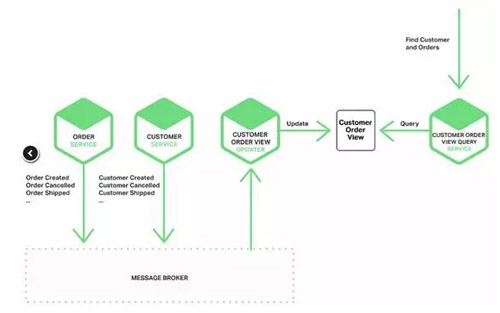

例如上图中间的 “客户订单视图更新”服务，主要负责客户订单视图的更新。该服务订阅了客户服务和订单服务发布的事件。当“客户订单视图更新”服务收到了上图左侧的客户或者订单更新事件，则会触发更新客户订单物化视图数据集。这里可以使用文档数据库(例如 MongoDB )来实现客户订单视图，为每个用户存储一个文档。而上图右侧的客户订单视图查询服务负责响应对客户以及最近订单(通过查询客户订单视图数据集)的查询。

总之，上图所示业务逻辑，用到了事件驱动、物化视图和命令查询职责分离等技术，有效解决了微服务架构下分布式数据查询的问题。

## 事件驱动架构优缺点

事件驱动架构既有优点也有缺点，此架构可以实现跨多个服务的事务实现，且提供最终数据一致性，并且使得服务能够自动维护查询视图;而缺点在于编程模式比传统基于事务的交易模式更加复杂，必须实现补偿事务以便从应用程序级故障中恢复，例如，如果信用检查不成功则必须取消订单;另外，应用必须应对不一致的数据，比如当应用读取未更新的最终视图时也会遇见数据不一致问题。另外一个缺点在于订阅者必须检测和忽略冗余事件，避免事件重复消费。

## 总结

在微服务架构中，每个微服务都有自己私有的数据集。不同微服务可能使用不同的SQL或者NoSQL数据库。尽管数据库架构有很强的优势，但是也面对数据分布式管理的挑战。第一个挑战就是如何在多服务之间维护业务数据一致性;第二个挑战是如何从多服务环境中获取一致性数据。

最佳解决办法是采用事件驱动架构。其中碰到的一个挑战是如何原子性的更新状态和发布事件。有几种方法可以解决此问题，包括将数据库视为消息队列和事件源等。

从目前技术应用范围和成熟度看，推荐使用第一种方式(本地事务发布事件)，来实现事件投递原子化，即可靠事件投递。

## 重要提醒

数据一致性是微服务架构设计中唯恐避之不及却又不得不考虑的话题。通过保证事件驱动实现最终数据的一致性，此方案的优劣，也不能简单的一言而概之，而是应该根据场景定夺，适合的才是最好的。另外，我们在对微服务进行业务划分的时候就尽可能的避免“可能会产生一致性问题”的设计。如果这种设计过多，也许是时候考虑改改设计了。