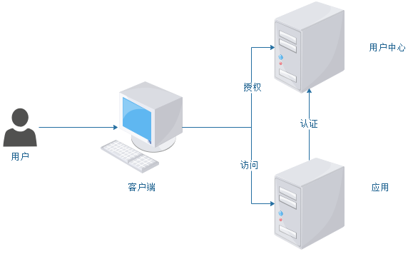

# 微服务的安全

OAuth 是一个关于授权的开放网络标准，它允许第三方网站在用户授权的前提下访问用户在服务商那里存储的各种信息。实际上，OAuth 2.0 允许用户提供一个令牌给第三方网站，一个令牌对应一个特定的第三方网站，同时该令牌只能在特定的时间内访问特定的资源。用户在客户端使用用户名和密码在用户中心获得授权，然后客户端在访问应用是附上 Token 令牌。此时，应用接收到客户端的 Token 令牌到用户中心进行认证。

一般情况下，access token 会添加到 HTTP Header 的 Authorization 参数中使用，其中经常使用到的是 Bearer Token 与 Mac Token。其中，Bearer Token 适用于安全的网络下 API 授权。MAC Token 适用于不安全的网络下 API 授权。