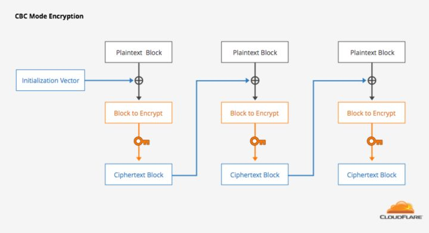
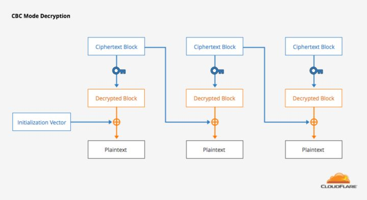
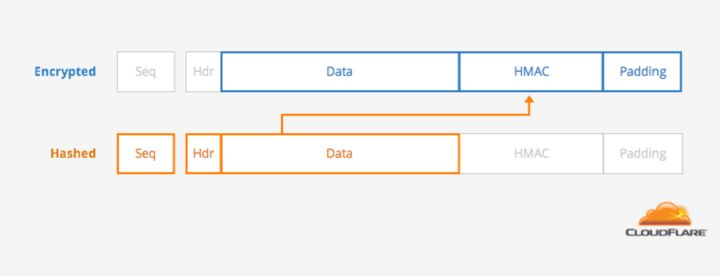
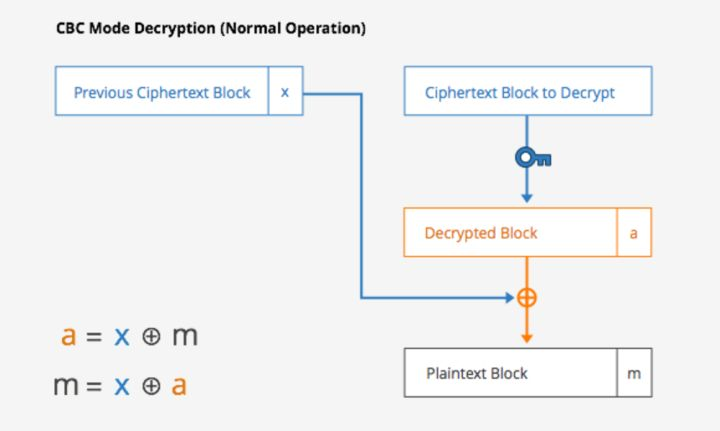
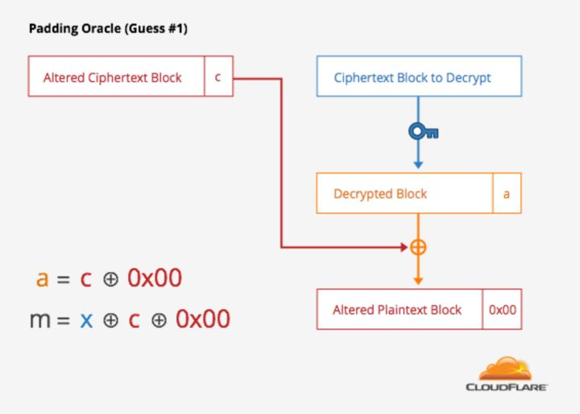

# HTTPS 降级攻击

## HTTPS

在传统流行的 WEB 服务中，由于 HTTP 协议没有对数据包进行加密，导致 HTTP 协议下的网络包是明文传输，所以只要攻击者拦截到 HTTP 协议下的数据包，就能直接窥探这些网络包的数据。HTTPS 协议就是来解决这个问题的。

简而言之，HTTPS 协议在应用层的 HTTP 协议和以及传输层 TCP 协议之间的会话层加入了 `SSL/TLS` 协议，用作加密数据包。会话层的这个加密协议，在真正数据传输之前，进行握手通信，握手的信息交换主要包括：双方确认加密协议的版本，确认身份（其中浏览器客户端的身份有时是不需要确认的），确认传输真正数据的加密密码（对称加密）。

在用作信息传输的加密密码确认之后，接下来的通信数据都会加密后再传输，从而达到防窃取的作用。

## HTTPS 协议降级

那么使用了 HTTPS 就能确保安全传输了吗？

可以说理想上是的，现实却不是。

原因简单来说就是：设计和实现 `SSL/TLS` 协议出现了漏洞，导致攻击者同样可以攻击一些旧版本的 `SSL/TLS` 协议。当 `SSL/TLS` 加密协议漏洞爆出来之后，最新版本的 `SSL/TLS` 协议修复了已知漏洞，但旧版本的加密协议却变得不安全了。

**那么什么又是“HTTPS协议降级”？**

在上一小节我们提到 `SSL/TLS` 协议通过握手来确定通信信息，其中握手双方要统一加密协议版本。在握手过程中这样确认加密协议版本：

- 由客户端（如浏览器）发送第一个数据包 `ClientHello`，这个数据包中保存着客户端支持的加密协议版本。
- 服务器收到这个 `ClientHello` 数据包，查看里面客户端支持的加密协议版本，然后匹配服务器自己支持的加密协议版本，从而确认双方应该用的加密协议版本。
- 服务器发送 `ServerHello` 数据包给客户端，告诉客户端要使用什么加密协议版本。

在上述过程中，如果客户端发送给服务器的 `ClientHello` 数据包中说自己仅支持某个有漏洞的旧版本加密协议（比如仅支持 `SSLv3.0`）,服务器有两种可能：

- 服务器支持很多版本，其中包括有漏洞的旧版本和新版本（包括了 `SSLv3.0` 协议），那么服务器会认可使用有漏洞的旧版本协议，从而告诉客户端使用有漏洞的旧版本（可以使用 `SSLv3.0`）。
- 服务器不支持有漏洞的旧版本，拒绝客户端的这次请求，握手失败。

对于攻击者，作为中间人只能监听到加密过的数据，如果这些数据通过没有漏洞的加密版本加密，攻击者并不能做什么。

但是，如果服务器提供有漏洞的旧版本加密协议的支持，而同时攻击者又能作为中间人控制被攻击者的浏览器发起漏洞版本的 HTTPS 请求，那虽然攻击者监听到的也是加密过的数据，但因为加密协议有漏洞，可以解密这些数据，所以数据就和明文传输没有什么差别了。

**这就是HTTPS协议降级。**

## SSLv3.0 的 AES 加密原理

攻击者通过握手将 HTTPS 通信协议降低到 SSLv3.0 之后，将会拦截到经过 SSLv3.0 加密过的数据，Padding Oracle 攻击可以解密这些数据。

**为什么叫 Padding**，我们从 SSLv3.0 的加密原理说起。

也是在第一小节，HTTPS 握手过程中，通信双方还确认了一个“加密密码”，这个密码是双方在握手过程中使用非对称加密的方式协商出来的对称加密密码。攻击者能拦截到的数据就是被这个密码加密的。

这个对称加密使用 AES 加密，AES 块密码会把要加密的明文切分成一个个整齐的块（如将明文以 16 个字节为一块分成很多块），如果最后一块不足一块，则会填充（Padding）满一块，再进行加密。这个填充就是 Padding Oracle 攻击的关键。

AES 是典型的块密码，块密码的加密方式有很多种，如果你不了解，可以查看块密码的工作模式。

SSLv3.0 中使用 `AES-CBC` 模式加密，我们来看加密和解密流程：

### 加密过程

- 明文首先被分成很多明文块，所有明文块的字节长度都一样，其中最后一个明文块经过了填充，若假设最后一个填充字节值为 L，则填充内容为值为L的字节重复 L 次（不包括最后一个字节本身） 。
- 加密从第一个明文块开始链式依次进行，其中，第一个明文块先和初始化的向量进行异或，之后使用加密 key 加密，生成第一个密文块。
- 将第一个密文块与第二个明文块异或，然后使用加密 key 加密，生成第二个密文块。
- 以此类推，第 N 个密文块，由第 N-1 个密文块和第 N 个明文块异或，然后使用加密 key 加密获得。
- 将所有获得的密文块依次拼接起来，就得到了最后的加密数据，这个数据是暴露在网络流量中的数据，也是攻击者可能截获的数据。

### 解密过程

- 将密文内容分为若干个密文块，每个密文块和加密时的明文块长度一样，此时由于加密时经过了填充，密文内容肯定能整齐的分割成整数个密文块。
- 对于第一个密文块，使用加密 key 解密之后，与加密时的初始化响亮异或获得第一个明文块。
- 对于其他的密文块，如第 N 个，使用加密 key 解密之后，与第 N-1 个密文块异或，获得相应的明文。

**这就是 SSLv3.0 的加密原理过程。**

## CBC 模式加密的 Padding Oracle 攻击

上一节我们解释了 CBC 模式加密过程，这种模式使用不当会遭到针对于 Padding 的攻击。

对于 SSL 协议，需要加密的数据包括信息本身和信息的MAC摘要值，在协议设计初期，由于大家考虑不周，使用了“先做信息摘要 MAC DATA，再做加密”的方式（MAC-then-encrypt）。

MAC-then-encrypt，这种方式可能遭到 Padding Oracle 攻击。SSL 协议在这种方式下，数据格式如图：

这是一次请求要传递的数据结构示意，其中 DATA 为最重要的数据，包括 COOKIE 甚至用户名密码等信息，HMAC 如图示是 DATA 以及其他一些序列数据的 MAC 摘要，最后是补充字节的 Padding。

在这种数据结构下，加密数据传输到接收者手里，会解密然后依次验证 Padding 数据和 HMAC 数据，来确认数据是正确的。

因此，接收者解密验证时主要有三种可能发生的情况：

- Padding 数据错误，拒绝，返回。
- HMAC 数据错误，拒绝，返回。
- 正确接收。

这 3 种返回给予了攻击者启示，我们再来看解密过程：

留意最后一个密文块，这个密文块首先会用加密 key 进行解密，然后与倒数第二个密文块进行异或。攻击者是能够截获到所有的密文内容的。

我们提到过 Padding 数据的规则是：若假设最后一个填充字节值为 L，则填充内容为值为L的字节重复 L 次（不包括最后一个字节本身） 。而验证 Padding 的过程也是按照规则来的：读取最后一个字节的值，并移除最后一个字节，然后验证剩下的 Padding 为 L 个值为 L 的字节。

也就是说，当最后一个字节值为 0x00 的时候，Padding 验证会直接通过。

假设：

- 倒数第二个密文块的最后一个字节值为 x（攻击者可见的）。
- 最后一个密文块，解密后最后一个字节值为 a (攻击者不可见）。
- 最后一个明文块最后一个字节为 m （攻击者不可见）。

可知， `a = x` 异或 `m` 并且 `m = x` 异或 `a`。

然后攻击者不断修改 `x` 的值，发送给接收者，那么 `m` 的值也会不断变化，并发生 Padding 数据验证失败返回。除非 `m` 变成 `0x00`, 此时不会返回 Padding 数据验证失败，而会返回 HMAC 数据验证失败。假设此时，`m` 的值被改为了 `c`，如图。

可知 `a = c` 异或 `0x00`。

由于 `a = x` 异或 `m` 并且 `m = x` 异或 `a`。

所以 `m` 也就是明文， `m = x` 异或 `c` 异或 `0x00`。其中， `x` 攻击者已知， `c` 通过不同的返回获知。 从而破解了明文中的最后一个字节。

有了 `m` 的值，也同时得到了 `a` 的值， 可以通过修改 `x` 的值控制 `m`，比如修改 `x` 的值使 `m = 0x01 = x` 异或 `a`。

将 `m` 设置成 `0x01` 的时候，遍历倒数第二个密文块的倒数第二个字节（最多256次），通过判断是否通过 Padding 验证，就能同理求出另外一个字节了。

以此类推可以解密整个数据包。

## Padding Oracle 攻击的防范

通过上一节可以看到攻击者是通过 Padding 验证返回和 MAC 验证返回结果不同来获得信息的，实际上，即使 Padding 验证失败和 MAC 验证失败都返回同样结果，攻击者也可以通过响应时间的不同通过 timing 的方式获得信息。

所以在协议中将验证失败的响应时间和响应结果统一，使攻击者不能区分能防范这种攻击。

而对于 SSL/TLS 协议的使用者，我们可以响应号召在自己服务器的加密协议支持列表上去掉 SSLv3.0。