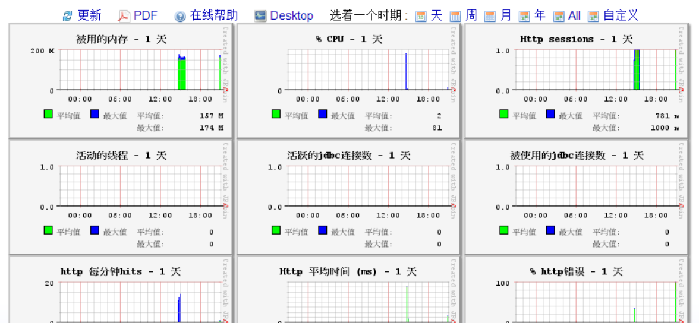

# 如何发现性能瓶颈

在找性能瓶颈之前，我们要先对系统性能有一个概念

> 如何在不购买新硬件的条件下完成更多的工作?何时才真正需要添加硬件(更多的内存，更快的磁盘、 CPU以及网络接口)?有时只需消除一些简单的瓶颈即可解决许多性能问题——但是要实现它，你必须充分了解自己的计算机和网络，从而找到真正的瓶颈所在。

说得直白一点，系统性能就是在尽可能减少投资的情况下，解决下面两个事：

1. Throughput：吞吐量。也就是每秒钟可以处理的请求数，任务数。
2. Response time：响应时间。也就是系统在处理一个请求或一个任务时的响应时间。

我们要做优化，就是为了让吞吐量更大，让响应时间更短，在二者之间达到平衡，满足我们的业务要求。

**所以，我们要发现性能瓶颈，其实就是找到影响吞吐量和响应时间的地方。**

## 使用压力测试工具发现性能瓶颈

网上的压力测试工具有很多，这里举几个实际工作中常用的

### Java Melody

能够在 QA 和实际运行生产环境监测 Java 或 Java EE 应用程序服务器。并以图表的形式显示：Java 内存和 Java CPU 使用情况，用户 Session 数量，JDBC 连接数，和 http 请求、sql 请求、jsp 页面与业务接口方法（EJB3、Spring、Guice）的执行数量，平均执行时间，错误百分比等。图表可以按天，周，月，年或自定义时间段查看。

### Apache JMeter

Apache JMeter 是一个专门为运行和服务器装载测试而设计的、100％ 的纯 Java 桌面运行程序。原先它是为 Web/HTTP 测试而设计的，但是它已经扩展以支持各种各样的测试模块。它和用于 HTTP 和 SQL 数据库（使用 JDBC）的模块一起运送。它可以用来测试静止资料库或者活动资料库中的服务器的运行情况，可以用来模拟对服务器或者网络系统加以重负荷以测试它的抵抗力，或者用来分析不同负荷类型下的所有运行情况。它也提供了一个可替换的界面用来定制数据显示，测试同步及测试的创建和执行。

### Load Runner

LoadRunner，是一种预测系统行为和性能的负载测试工具。通过以模拟上千万用户实施并发负载及实时性能监测的方式来确认和查找问题，LoadRunner 能够对整个企业架构进行测试。企业使用 LoadRunner 能最大限度地缩短测试时间，优化性能和加速应用系统的发布周期。 LoadRunner 可适用于各种体系架构的自动负载测试，能预测系统行为并评估系统性能。

## 发现瓶颈，怎么办？

先去操作系统，操作系统的报告。看看操作系统的 `CPU 利用率`，看看 `内存使用率`，看看 `操作系统的 IO`，还有 `网络的 IO`，`网络链接数`，等等。通过了解操作系统的性能，我们才知道性能的问题，比如：带宽不够，内存不够，TCP 缓冲区不够，等等，很多时候，不需要调整程序的，只需要调整一下硬件或操作系统的配置就可以了。说这些是为了提醒你，不要急着去修改你的代码。

如果到了非要动代码的地步，瓶颈这东西也可以根据 2：8 原则来说，20% 的代码耗了你 80% 的性能，找到那 20% 的代码，你就可以优化那 80% 的性能。所以，紧紧锁定那不到 20% 的代码。