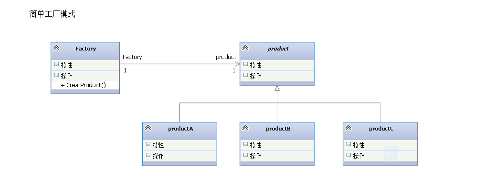
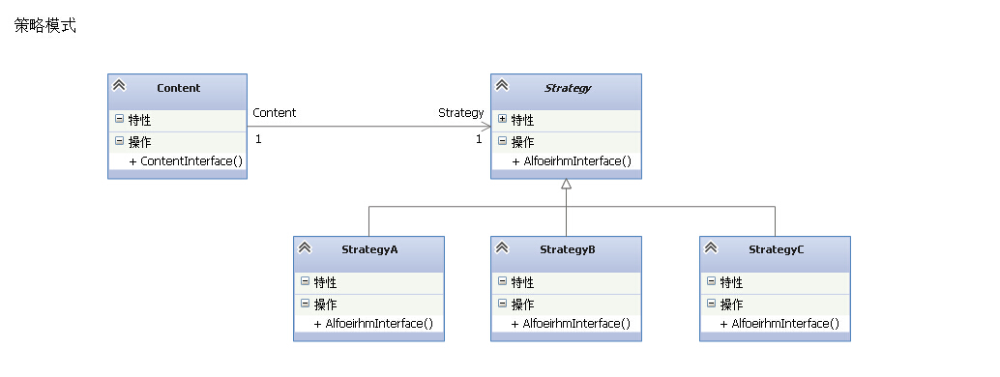

# 设计模式之间的结合，例如策略模式 + 简单工厂模式的实践

## 前言

简单工厂模式和策略模式是大部分程序员，在学习设计模式时接触得最早，或在工作实践中也是用得相对比较多的两个设计模式。

一个是创建型，另一个是行为型，然而两种不同类型的模式，在某些地方也有一丝的相似之处，同时在某种场景下结合使用，能起到特别好的效果。

## 问题

简单工厂模式和策略模式很相似。怎么相似？都是三个业务子类继承抽象父类，通过传入参数到容器类（工厂模式的 factory 类，策略模式的 Content 类），选择对应的类进行行为操作。

其实，UML 图的确从外形上看没多大区别，但是，本质却是大大不同。

## 简单工厂模式

上面提到过，简单工厂模式是创建型模式，创建型模式顾名思义，也就是说在创建对象的时候，遇到了瓶颈才会选择的设计模式。那么该什么情况使用呢。

简单工厂模式的实质是由一个工厂类根据传入的参数，**动态决定**应该**创建并且返回**哪一个产品类（这些产品类继承自一个父类或接口）的实例。

那么也就是说：

- 有已知的产品类
- 你无法准确的知道编译哪个产品类
- 需要在运行时决定创建哪个产品类
- 产品类不多

很明显看出，在创建对象上的灵活性高，但是工厂类只能创建可能会使用到的产品类，假如新添了产品类就得修改工厂类，这样就会违反开闭原则。

## 策略模式

策略模式是行为型模式，它定义了一系列的算法，并将每一个算法封装起来，而且使它们还可以相互替换。策略模式让算法独立于使用它的客户而独立变化。

在一段代码里，使用了逻辑控制（if-else, swich-case）来决定算法，算法有相似的方法和函数，就可以选择策略模式。

那么也就是说：

- 某方法里有多个条件语句，条件语句代码块里有许多行为过程。
- 其算法能封装到策略类
- 算法随意切换
- 算法与客户端隔离

这样一来，通过选择对应的策略类，作为参数传到 Content 类里，在**运行时**配置对应的算法。

## 区别总结

从上面的描述总结出，在运行时，两者都是通过传入参数进行配置，简单工厂模式则是选择创建出需要的对象，而策略模式则是配置出需要的行为算法。一个是对象创建，另一个是行为算法的替换。