# 说说常用开源框架中设计模式使用分析

## 一、前言

设计模式代表了软件设计的最佳实践，是经过不断总结提炼出来的代码设计经验的分类总结，这些模式或者可以简化代码，或者可以是代码逻辑开起来清晰，或者对功能扩展很方便

设计模式按照使用场景可以分为三大类：

- 创建型模式（Creational Patterns）：对对象的实例化过程进行抽象，这使得一个系统可以不用关心这些对象是如何创建，组合，呈现的，对于类创建模式来说通过使用继承改变实例化的类，对于对象创建模式来说通过使用代理来实例化所需要的对象。
  - 工厂模式
  - 原型模式
  - 构建者模式
  - 单例模式
- 结构型模式（Structural Patterns）：通过对多个类和对象进行组合得到复杂结构的类，一般使用继承继承或者成员变量引用形式来实现。
  - 适配器模式
  - 桥接模式
  - 过滤器模式
  - 组合模式
  - 装饰者模式
  - 门面模式
  - 享元模式
  - 代理模式
- 行为型模式（Behavioral Patterns）：行为模式不仅表达了对象和类，还表达了他们之间的交互，涉及到了对象和算法的分配。
  - 责任链模式
  - 命令模式
  - 解释器模式
  - 迭代器模式
  - 中介者模式
  - 备忘录模式
  - 观察者模式
  - 状态模式
  - 空对象模式
  - 策略模式
  - 模板方法模式
  - 访问者模式

## 二、责任链设计模式（Chain of Responsibility Pattern）

### 介绍

责任链模式是把多个对象串联起来形成一个链状结构，让每个对象都有机会对事件发送者的请求进行处理。责任链模式是设计模式中的行为模式，设计意图是为了使事件发送者和事件接受者之间解耦。通常责任链链中的每个对象都有下一个对象的引入（例如 Tomcat 里面 `StandardPipeline` 用来管理 `valve`），或者有个同一个链管理工厂里面使用数组存放了所有的对象（例如 Tomcat 里面 `ApplicationFilterChain` 用来关系 filter）。

### Tomcat 中 Valve 链

Tomcat 中 `StandardEngine`, `StandardHost`, `StandardContext` 里面都有自己 `StandardPipeline`,下面以 `StandardEngine` 里面 `StandardPipeline` 为例讲解

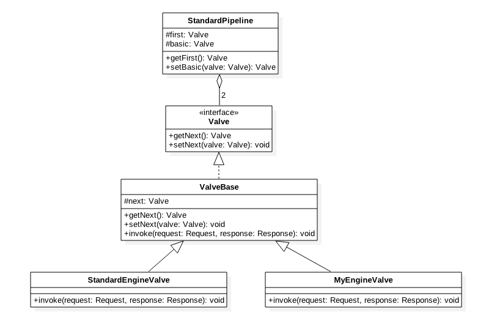

从上面类图可知道每个 `Valve` 都要继承 `ValveBase` 类，该类里面有一个 `Valve` 的引用，实际是链中下一个节点对象，`Valve` 就是通过每个 `Valve` 里面的 `next` 串联为链的。

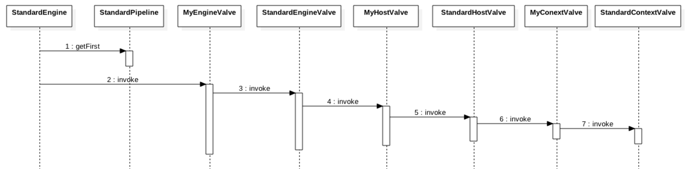

每个 `valve` 的 `invoke` 方法里面调用 `next.invoke` 激活链中下一个节点,并且 `StandardEngine`, `StandardHost`, `StandardContext` 都有一个 `basic valve` 这个 `valve` 在链的末尾用来激活子容器的 `valve` 链。

### Tomcat 中 Filter 链

Tomcat 中 `Filter` 链是使用 `ApplicationFilterChain` 来管理的，具体结构如下图：

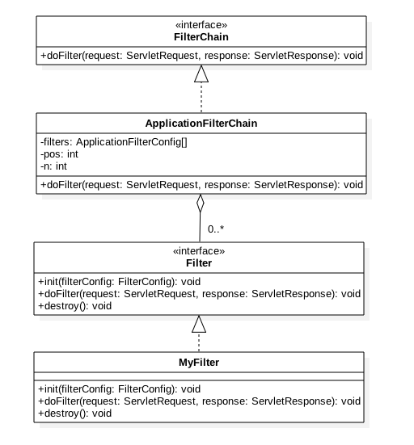

可知 `Filter` 链不是像 `Valve` 一样在内部维护下个节点的引用，而是在 `ApplicationFilterChain` 中搞了个数组存放所有的 `Filter`，并通过 `n` 统计 `Filter` 总个数，`pos` 是当前 `filter` 的下标。

`ApplicationFilterChain` 的 `doFilter` 代码如下：

```text
public void doFilter(ServletRequest request, ServletResponse response)
        throws IOException, ServletException {
        ...
        internalDoFilter(request,response);
        ...
    }


private void internalDoFilter(ServletRequest request, ServletResponse response) throws IOException, ServletException {

        // Call the next filter if there is one
        if (pos < n) {

            //获取filter链中下标为pos的filter
            ApplicationFilterConfig filterConfig = filters[pos++];
            Filter filter = null;
            try {
                filter = filterConfig.getFilter();
                support.fireInstanceEvent(InstanceEvent.BEFORE_FILTER_EVENT,
                                          filter, request, response);

                if (request.isAsyncSupported() && "false".equalsIgnoreCase(
                        filterConfig.getFilterDef().getAsyncSupported())) {
                    request.setAttribute(Globals.ASYNC_SUPPORTED_ATTR,
                            Boolean.FALSE);
                }

                ...

                //调用自定义filter的dofilter方法
                filter.doFilter(request, response, this);


                support.fireInstanceEvent(InstanceEvent.AFTER_FILTER_EVENT,
                                          filter, request, response);
            } 
            ....

    }
   .....
}
```

### 使用场景

- 当一个请求需要根据请求参数的不同由不同对象来处理时候。
- 当一个请求需要固定对象顺序处理，并且可扩展性的在固定顺序里面插入新的对象进行处理时候。

## 三、工厂模式（Factory Pattern）

### 介绍

工厂模式是创建型模式，他封装了对象的创建过程，调用者使用具体的工厂方法根据参数就可以获取对应的对象。

### Spring 框架中 BeanFactory

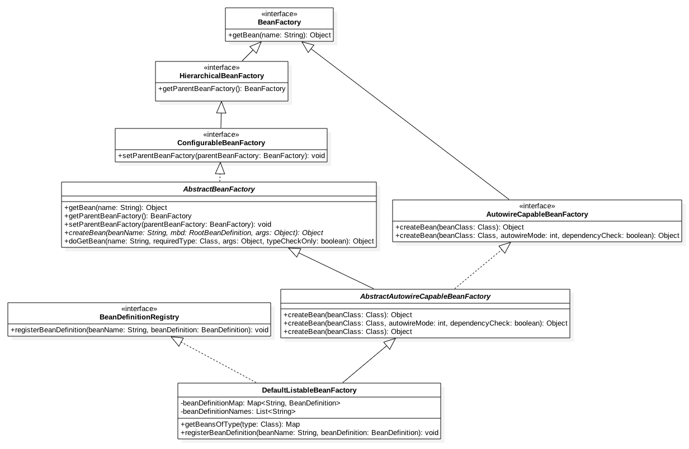

如图 `BeanFactory` 接口提供了 `getBean` 方法，在 `AbstractBeanFactory` 中实现了该方法，经过层层继承，实现，最后 `DefaultListableBeanFactory` 实现了 `BeanDefinitionRegistry` 接口用来保存 `bean` 定义，继承了 `AbstractAutowireCapableBeanFactory` 用来支撑 `autowired`。

### 举个例子

```text
@Test
public void testBeanFactoy() throws NamingException, SQLException, ParseException, IOException {

    // 创建 Bean 工厂
    DefaultListableBeanFactory bf = new DefaultListableBeanFactory();

    // 给 Bean 工厂添加 Bean 定义, 解析 xml 里面的 Bean 放入 Bean 工厂
    loadBeanDefinitions(bf);

    // 根据名字从 Bean 工厂获取 Bean
    Hello hello = (Hello) bf.getBean("hello");
    hello.sayHello();

    Hello2 hello2 = (Hello2) bf.getBean("hello2");
    hello2.sayHello();


}

protected void loadBeanDefinitions(DefaultListableBeanFactory beanFactory) throws IOException {
    XmlBeanDefinitionReader beanDefinitionReader = new XmlBeanDefinitionReader(beanFactory);

    String[] configLocations = new String[] { "beans2.xml" };
    if (configLocations != null) {
        beanDefinitionReader.loadBeanDefinitions(configLocations);
    }
}
```

### 使用场景

- 不同条件下创建不同实例，用于统一管理 Bean
- 不同条件下调用不同工厂方法获取不同场景下的 Bean

## 四、单例设计模式（Singleton Pattern）

### 介绍

单例模式是一种创建型模式，单例模式提供一个创建对象的接口，但是多次调用该接口返回的是同一个实例的引用，目的是为了保证只有一个实例，并且提供一个访问这个实例的统一接口。

### Spring 中单例 Bean 的创建

Spring 中默认配置的 `bean` 的 `scope` 为 `singleton`，也就是单例作用域。那么看看它是如何做到的。在 `AbstractBeanFactory` 类里面的 `doGetBean` 方法：

```text
protected Object doGetBean(
            final String name, final Class requiredType, final Object[] args, boolean typeCheckOnly) throws BeansException {

    final String beanName = transformedBeanName(name);
    Object bean = null;

    // 解决set循环依赖
    Object sharedInstance = getSingleton(beanName);
    if (sharedInstance != null && args == null) {
        ...
    }

    else {
        ...
        // 创建单件bean.
        if (mbd.isSingleton()) {
            sharedInstance = getSingleton(beanName, new ObjectFactory() {
                public Object getObject() throws BeansException {
                    try {
                        return createBean(beanName, mbd, args);
                    }
                    catch (BeansException ex) {
                    ...
                        throw ex;
                    }
                }
            });
            bean = getObjectForBeanInstance(sharedInstance, name, beanName, mbd);
        }
       //创建原型bean
        else if (mbd.isPrototype()) {
            ...
        }
        //创建request作用域bean
        else {
            ...
        }
    }
            ...
    return bean;
}
```

getSingleton 代码：

```text
public Object getSingleton(String beanName, ObjectFactory singletonFactory) {
    Assert.notNull(beanName, "'beanName' must not be null");
    synchronized (this.singletonObjects) {
        Object singletonObject = this.singletonObjects.get(beanName);
        if (singletonObject == null) {
            ...
            beforeSingletonCreation(beanName);
            ...
            try {
                singletonObject = singletonFactory.getObject();
            }
            catch (BeanCreationException ex) {
                ...
            }
            finally {
                if (recordSuppressedExceptions) {
                    this.suppressedExceptions = null;
                }
                afterSingletonCreation(beanName);
            }
            addSingleton(beanName, singletonObject);
        }
        return (singletonObject != NULL_OBJECT ? singletonObject : null);
    }
}

protected void addSingleton(String beanName, Object singletonObject) {
    synchronized (this.singletonObjects) {
        this.singletonObjects.put(beanName, (singletonObject != null ? singletonObject : NULL_OBJECT));
        this.singletonFactories.remove(beanName);
        this.earlySingletonObjects.remove(beanName);
        this.registeredSingletons.add(beanName);
    }
}

private final Map singletonObjects = CollectionFactory.createConcurrentMapIfPossible(16);
```

可知 Spring 内部四通过一个 `ConcurrentMap` 来管理单件 `bean` 的。获取 `bean` 时候会先看看 `singletonObjects` 中是否有，有则直接返回，没有则创建后放入。

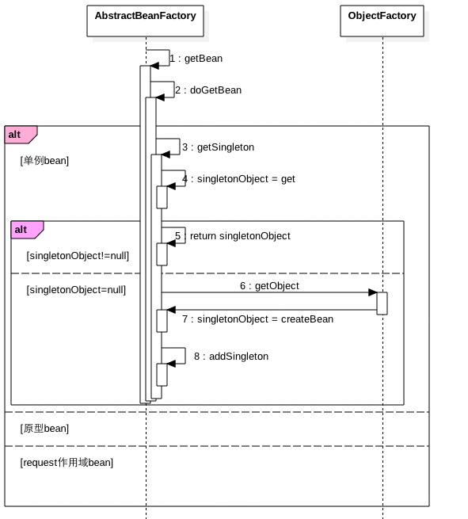

Spring 的 `bean` 工厂管理的单例模式管理的是多个 `bean` 实例的单例，是工厂模式管理所有的 `bean`,而每个 `bean` 的创建又使用了单例模式。

### 使用场景

- 同一个 JVM 应用的不同模块需要使用同一个对象实例进行信息共享。
- 需要同一个实例来生成全局统一的序列号

## 五、原型设计模式（Prototype Pattern）

### 介绍

相比单例设计模式，原型模式是每次创建一个对象，下面看下 Spring 是如何使用原型模式的

### Spring 中原型 bean 的创建

创建原型 `bean` 需要在 `xml` 特别说明：

```text
<bean id="hello" class="com.lusifer.demo.Hello" scope="prototype"/>
```

```text
protected <T> T doGetBean(
        final String name, final Class<T> requiredType, final Object[] args, boolean typeCheckOnly)
        throws BeansException {

    final String beanName = transformedBeanName(name);
    Object bean;

    // Eagerly check singleton cache for manually registered singletons.
    Object sharedInstance = getSingleton(beanName);
    if (sharedInstance != null && args == null) {
     ...
    }

    else {
        ...

        try {
            ...

            // Create bean instance.
            if (mbd.isSingleton()) {
                ...
            }
            //创建原型bean
            else if (mbd.isPrototype()) {
                // It's a prototype -> create a new instance.
                Object prototypeInstance = null;
                try {
                    beforePrototypeCreation(beanName);
                    prototypeInstance = createBean(beanName, mbd, args);
                }
                finally {
                    afterPrototypeCreation(beanName);
                }
                bean = getObjectForBeanInstance(prototypeInstance, name, beanName, mbd);
            }

            else {
                ...
            }
        }
        catch (BeansException ex) {
            cleanupAfterBeanCreationFailure(beanName);
            throw ex;
        }
    }
 ...
    return (T) bean;
}
```

`createBean` 函数里面则是根据 `bean` 定义创建新 `bean`，感兴趣的可以看看。

### 使用场景

当有业务场景使用某个 `bean` 时候需要使用自己的一个拷贝的时候使用。

## 六、策略模式（Strategy Pattern）

### 介绍

策略模式属于行为性模式，它定义一系列的算法对象,使用时候可以使它们相互替换。

### Spring 中 bean 实例化策略

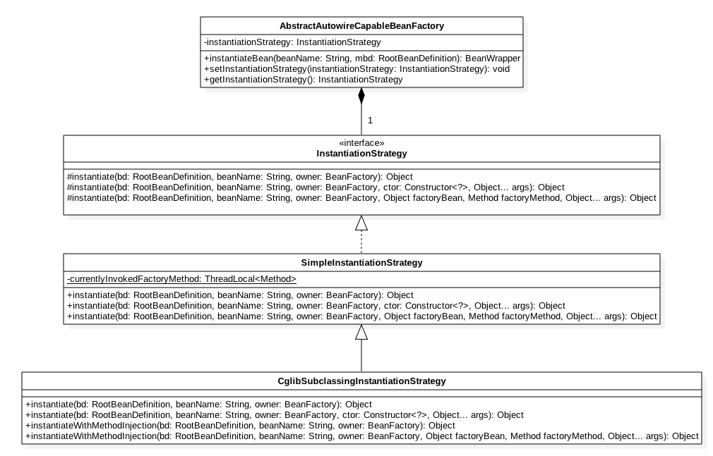

从图知道：接口 `InstantiationStrategy` 是实例化策略接口类，它定义了三个实例化接口，然后 `SimpleInstantiationStrategy` 实现了该策略，它主要做一些简单的根据构造函数实例号 `bean` 的工作，然后 `CglibSubclassingInstantiationStrategy` 又继承了 `SimpleInstantiationStrategy` 新增了方法注入方式根据 `cglib` 生成代理类实例化方法。

在 `AbstractAutowireCapableBeanFactory` 中管理了该策略的一个对象，默认是 `CglibSubclassingInstantiationStrategy` 策略，运行时候可以通过 `setInstantiationStrategy` 改变实例化策略，如果你自己写个个策略的话。

### Spring 中 AOP 代理策略

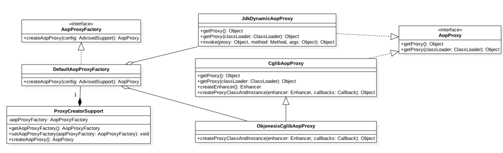

首先看 `AopProxyFactory` 接口类提供了 `createAopProxy` 接口，这个是策略模式的接口方法。然后 `DefaultAopProxyFactory` 实现了该接口作为策略的实现者。然后 `ProxyCreatorSupport` 里面引用了 `AopProxyFactory`，并且提供了 `get`, `set` 方法用来运行时改变策略，这里 Spring 只实现了 `DefaultAopProxyFactory` 这一个策略，如果需要自己也可以写个。

`DefaultAopProxyFactory` 里面的 `createAopProxy` 的逻辑如下，可以在运行时根据参数决定用 `Cglib` 策略还是 `JDK动态代理` 策略生成代理类：

```text
public AopProxy createAopProxy(AdvisedSupport config) throws AopConfigException {
    // 如果 XML 打开了优化开关，或者设置为了代理目标类，或者目前类没有接口
    if (config.isOptimize() || config.isProxyTargetClass() || hasNoUserSuppliedProxyInterfaces(config)) {
        Class<?> targetClass = config.getTargetClass();
        if (targetClass == null) {
            throw new AopConfigException("TargetSource cannot determine target class: " +
                    "Either an interface or a target is required for proxy creation.");
        }

        // 如果有接口，或者通过 Proxy.newProxyInstance 生成的，则使用 JDK动态代理
        if (targetClass.isInterface() || Proxy.isProxyClass(targetClass)) {
            return new JdkDynamicAopProxy(config);
        }

        // 使用 CGLIB
        return new ObjenesisCglibAopProxy(config);
    }
    else {
        // 使用 JDK动态代理
        return new JdkDynamicAopProxy(config);
    }
}
```

另外 `AopProxy` 也是一个策略接口类，具体实现的策略为 `JdkDynamicAopProxy`，`CglibAopProxy`，`ObjenesisCglibAopProxy`

### Tomcat 中 Digester 解析 server.xml

Tomcat 中的 `Digester` 是为了解析 `server.xml` 的，其中每个元素都有一个解析规则就是 `Rule`，DigestER 一开始先指定不同的解析策略（Rule），然后在具体解析 server.xml 时候根据节点不同使用不同解析策略来解析节点。

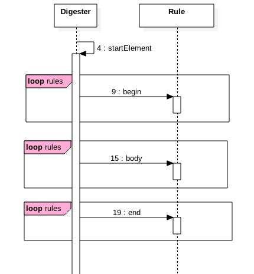

如图在解析每个节点时候会先找到该节点对应的解析策略，然后循环去调用所有解析策略的方法去处理。

### 使用场景

运行时根据条件的不同使用不同的策略处理一个事情，与责任链不同在于，责任链是一个链条，一个事情可以被责任链里面所有节点处理，而 策略模式则是只有有一个对象来处理。

## 七、门面模式（Facade Pattern）

### 介绍

门面模式是一种结构性模式，它通过新增一个门面类对外暴露系统提供的一部分功能，或者屏蔽了内部系统的复杂性，对外部仅仅暴露一个简单的接口，或者通过调用不同的服务对外提供统一的接口，让使用者对这些内部服务透明化。

### 模板引擎 Velocity 中门面模式使用

Velocity 里面的 `VelocityEngine` 和 `Velocity` 类都是 `RuntimeInstance` 类的门面，后者提供了模板渲染的所有功能，前两者则是内部维护 `RuntimeInstance` 的实例，具体工作还是委托给 `RuntimeInstance` 来实现。

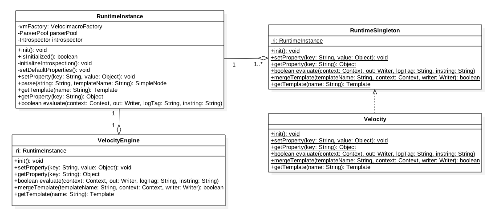

如图 `RuntimeInstance` 提供了 `Velocity` 引擎的所用功能，`VelocityEngine` 内部直接引用了 `RuntimeInstance` 的一个实例，`VelocityEngine` 对外暴露的服务都是委托 `RuntimeInstance` 实现，并且每次 `new` 一个 `VelocityEngine` 内部都会有 `RuntimeInstance` 的一个实例被创建。而 `Velocity` 类调用了单例模式类 `RuntimeSingleton` 里面的方法，`RuntimeSingleton` 又是 `RuntimeInstance` 的一个单例模式。

### 使用场景

- 当需要对外屏蔽一个系统的复杂性时候可以考虑使用门面模式对外提供简单可读性高的接口类
- 当需要对外部暴露系统一部分权限的接口时候可以考虑使用门面模式减少系统权限。
- 当系统需要调用不同服务汇总后在对外提供服务时候可以考虑使用门面模式对外屏蔽细节，之暴露一个接口。

## 八、装饰器模式（Decorator Pattern）

### 介绍

装饰器模式是一种结构性模式，它作用是对对象已有功能进行增强，但是不改变原有对象结构。这避免了通过继承方式进行功能扩充导致的类体系臃肿。

### Spring 中 BeanDefinitionDecorator

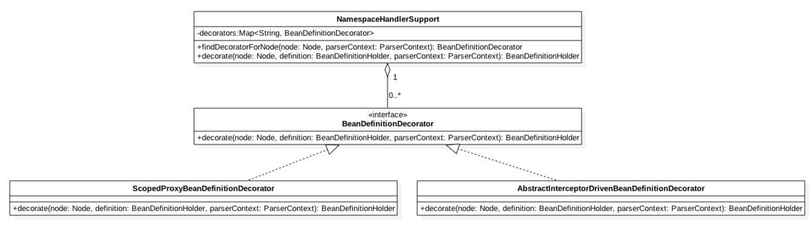

如图 `ScopedProxyBeanDefinitionDecorator` 实现了 `decorate` 方法用来对 `scope` 作用域为 `request` 的 `bean` 定义进行包装。具体时序图为：

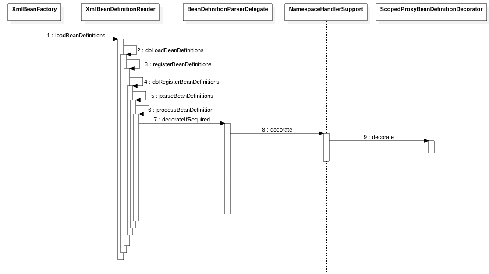

```text
class ScopedProxyBeanDefinitionDecorator implements BeanDefinitionDecorator {

    private static final String PROXY_TARGET_CLASS = "proxy-target-class";


    @Override
    public BeanDefinitionHolder decorate(Node node, BeanDefinitionHolder definition, ParserContext parserContext) {
        boolean proxyTargetClass = true;
        if (node instanceof Element) {
            Element ele = (Element) node;
            if (ele.hasAttribute(PROXY_TARGET_CLASS)) {
                proxyTargetClass = Boolean.valueOf(ele.getAttribute(PROXY_TARGET_CLASS));
            }
        }

        // 创建scoped的代理类，并注册到容器
        BeanDefinitionHolder holder =
                ScopedProxyUtils.createScopedProxy(definition, parserContext.getRegistry(), proxyTargetClass);
        String targetBeanName = ScopedProxyUtils.getTargetBeanName(definition.getBeanName());
        parserContext.getReaderContext().fireComponentRegistered(
                new BeanComponentDefinition(definition.getBeanDefinition(), targetBeanName));
        return holder;
    }

}
```

关于 `ScopedProxyBeanDefinitionDecorator` 干啥用的呢：

```text
<bean id="lavaPvgInfo" class="com.alibaba.lava.privilege.PrivilegeInfo"
    scope="request">
    <property name="aesKey" value="666" />
    <aop:scoped-proxy />
</bean>
```

其实就是处理 `<aop:scoped-proxy />` 的，具体作用是包装 `lavaPvgInfo` 的 `bean` 定义为 `ScopedProxyFactoryBean`，作用是实现 `request` 作用域 `bean`

### commons-collections 包中 ListUtils

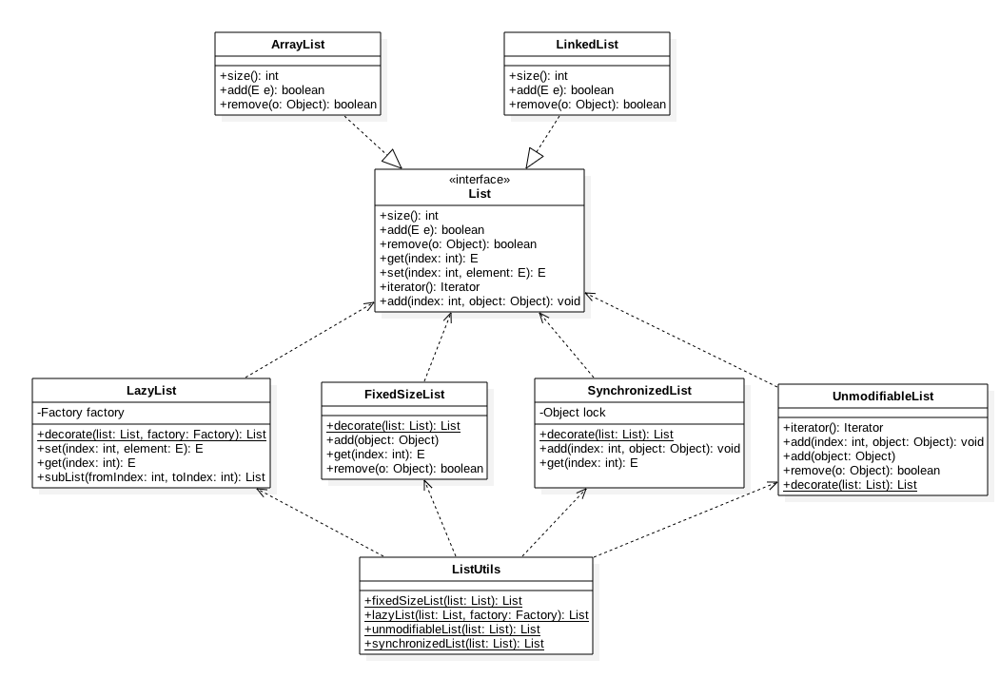

- `ListUtils` 中的四个方法分别依赖 `list` 的四种装饰器类对 `List` 功能进行扩充和限制。
- 其中 `FixedSizeList` 类通过禁止 `add/remove` 操作保证 `list` 的大小固定，但是可以修改元素内容
- 其中 `UnmodifiableList` 类通过禁用 `add`, `clear`, `remove`, `set`,保证 `list` 的内容不被修改
- 其中 `SynchronizedList` 类通过使用 `Lock` 来保证 `add`, `set`, `get`, `remove` 等的同步安全
- 其中 `LazyList` 类则当调用 `get` 方法发现 `list` 里面不存在对象时候，自动使用 `factory` 创建对象.

### 使用场景

在不改变原有类结构基础上，新增或者限制或者改造功能时候。

## 九、适配器模式（Adapter Pattern）

### 介绍

适配器模式属于结构性模式，它为两个不同接口之间互通提供了一种手段。

### Spring 中 MethodInterceptor 适配器

在 Spring Aop 框架中，`MethodInterceptor` 接口被用来拦截指定的方法，对方法进行增强。

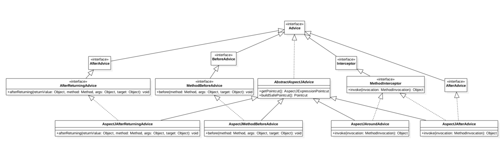

大家都知道在 AOP 中每个 `advistor` 里面会有一个 `advice` 具体做切面动作，Spring 提供了 `AspectJAfterReturningAdvice`，`AspectJMethodBeforeAdvice`，`AspectJAroundAdvice`，`AspectJAfterAdvice` 这几个 `advice`,在 XML 配置 AOP 时候会指定 `<aop:after-returning/>`, `<aop:before/>`, `<aop:around/>`, `<aop:after/>`, 其实内部就是创建上面对应的这些 `advice`。

从图知道 `AspectJAfterReturningAdvice` 和 `AspectJMethodBeforeAdvice` 没有实现 `MethodInterceptor` 接口，其他两者则实现了该接口。而 Spring Aop 的方法拦截器却必须是实现了 `MethodInterceptor` 的，所以 Spring 提供了对应的适配器来适配这个问题,分别是 `MethodBeforeAdviceAdapter` 和 `AfterReturningAdviceAdapter` 和 `ThrowsAdviceAdapter`。

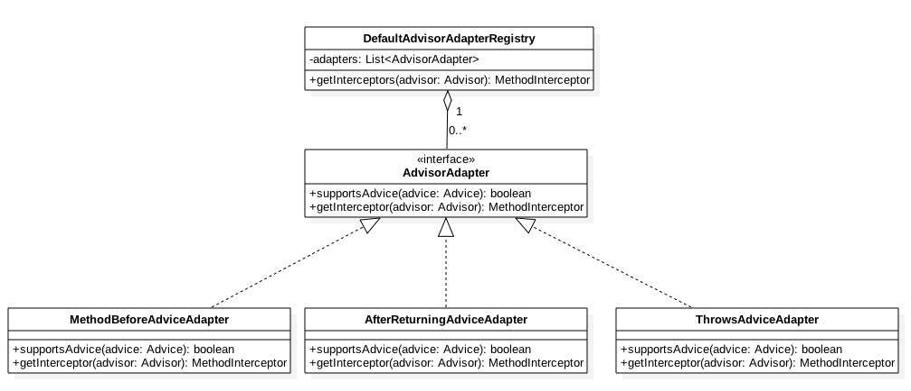

看下 `DefaultAdvisorAdapterRegistry` 的 `getInterceptors` 方法：

```text
public MethodInterceptor[] getInterceptors(Advisor advisor) throws UnknownAdviceTypeException {
    List<MethodInterceptor> interceptors = new ArrayList<MethodInterceptor>(3);

    //从advistor中获取advice
    Advice advice = advisor.getAdvice();

    //如果实现了MethodInterceptor则直接加入，比如AspectJAroundAdvice，AspectJAfterAdvice
    if (advice instanceof MethodInterceptor) {
        interceptors.add((MethodInterceptor) advice);
    }

    //否者看是否有当前advice的适配器，首先检验是否支持，支持则返回对应的适配器
    for (AdvisorAdapter adapter : this.adapters) {
        if (adapter.supportsAdvice(advice)) {
            interceptors.add(adapter.getInterceptor(advisor));
        }
    }
    if (interceptors.isEmpty()) {
        throw new UnknownAdviceTypeException(advisor.getAdvice());
    }
    return interceptors.toArray(new MethodInterceptor[interceptors.size()]);
}
```

以 `MethodBeforeAdviceAdapter` 为例子看下：

```text
class MethodBeforeAdviceAdapter implements AdvisorAdapter, Serializable {

    public boolean supportsAdvice(Advice advice) {
        return (advice instanceof MethodBeforeAdvice);
    }

    public MethodInterceptor getInterceptor(Advisor advisor) {
        MethodBeforeAdvice advice = (MethodBeforeAdvice) advisor.getAdvice();
        return new MethodBeforeAdviceInterceptor(advice);
    }

}

public class MethodBeforeAdviceInterceptor implements MethodInterceptor, Serializable {

    private MethodBeforeAdvice advice;


    /**
     * Create a new MethodBeforeAdviceInterceptor for the given advice.
     * @param advice the MethodBeforeAdvice to wrap
     */
    public MethodBeforeAdviceInterceptor(MethodBeforeAdvice advice) {
        Assert.notNull(advice, "Advice must not be null");
        this.advice = advice;
    }

    public Object invoke(MethodInvocation mi) throws Throwable {
        this.advice.before(mi.getMethod(), mi.getArguments(), mi.getThis() );
        return mi.proceed();
    }

}
```

可知 `MethodBeforeAdviceInterceptor` 继承了 `MethodInterceptor` 作为了一个适配器内部委托请求给 `MethodBeforeAdvice`。

### 使用场景

- 两个系统交互时候由于接口参数不一样没办法直接对接，则可以搞个适配器接口做参数转换。
- 适配器模式经常是在一个系统或者设计已经定型时候用的，而不是在初始设计时候。一般是因为不影响现在业务情况下，通过适配方式统一接口

## 十、模板方法模式（Template Pattern）

### 介绍

模板设计模式是一种行为设计模式，它使用一个抽象类定义了一个模板，这个模板里面定义了一系列的接口，子类则只需要继承该抽象类并且根据需要重写一部分接口。

### ibatis2 中 AbstractDAOTemplate

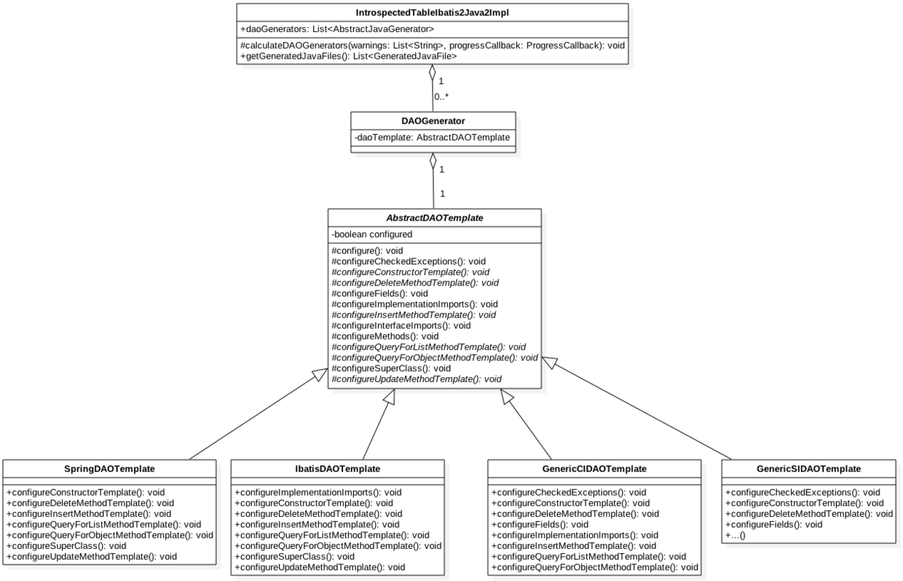

如图 `AbstractDAOTemplate` 是抽象模板类，里面定义了 `configure` 方法，`configure` 方法里面定义了好多 `protected` 方法，其中就有些是抽象方法。类 `SpringDAOTemplate`，`IbatisDAOTemplate`，`GenericCIDAOTemplate`，`GenericSIDAOTemplate` 则继承了 `AbstractDAOTemplate` 类并重写了一部分方法。

### Tomcat 中 Digester 里面的 Rule

Tomcat 中的 `Digester` 是为了解析 `server.xml` 的，其中每个元素都有一个解析规则就是 `Rule` ,类图如下：

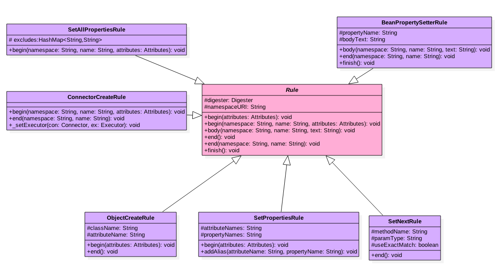

如图：Rule 是抽象类，对于每个解析的节点来说 Rule 提供了解析所需所有的方法，而他的子类则根据自己的特殊性重写一部分方法来支持自己的特性。

### Tomcat 中 Endpoint

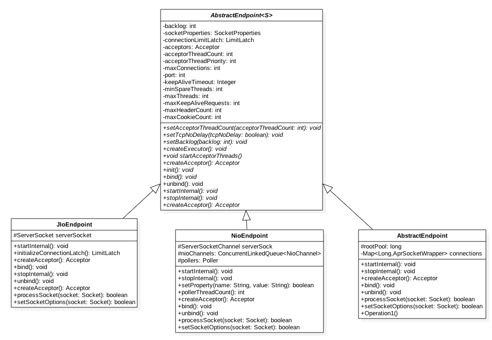

如图 `AbstractEndpoint` 是个抽象类，定义了 `Endpoint` 的所有接口，然后 `JIoEndpoint` 继承了该类并且重写了一部分重要的方法实现了 `BIO` 方式 `endpoint` , `NioEndpoint` 则重写了方法实现了 `NIO` 的 `endpoint`.

### 使用场景

当多个子类具有共同的操作流程逻辑，并且其中某些流程节点操作需要自己定制化时候。

## 十一、建造者模式（Builder Pattern）

### 介绍

建造者模式是一种创建型模式，将一个复制对象的创建屏蔽到接口内部，用户使用时候只需要传递固定的参数，内部就会执行复杂逻辑后返回会用户需要的对象，用户不需要知道创建的细节。

### Mybatis 中的 SqlSessionFactoryBuilder

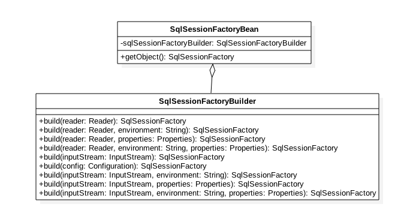

如图 MyBaits 中的 `SqlSessionFactoryBuilder` 就是典型的创建者模式，他内部有多个 `build` 方法，根据参数的不同创建出 `SqlSessionFactory` 对象，使用者只需要传递具体参数而不用关系内部是如何创建出需要的对象的。`SqlSessionFactoryBean` 大家应该很熟悉，在 xml 里面配置的。

### 使用场景

当一个对象比较复杂并且容易出错时候，可以考虑这种模式去屏蔽创造细节。

## 十二、观察者模式（Observer Pattern）

### 介绍

观察者模式是一种行为模式，它定义了当一个对象的状态或者属性发生变化时候，通通知其他对这些状态感兴趣的对象。观察者模式也叫发布-订阅模式，就是说当你订阅了摸一个主体时候，如果发布者改变了主题内容，那么所有订阅这个主体者都会受到通知。

### Spring 中 ApplicationListener

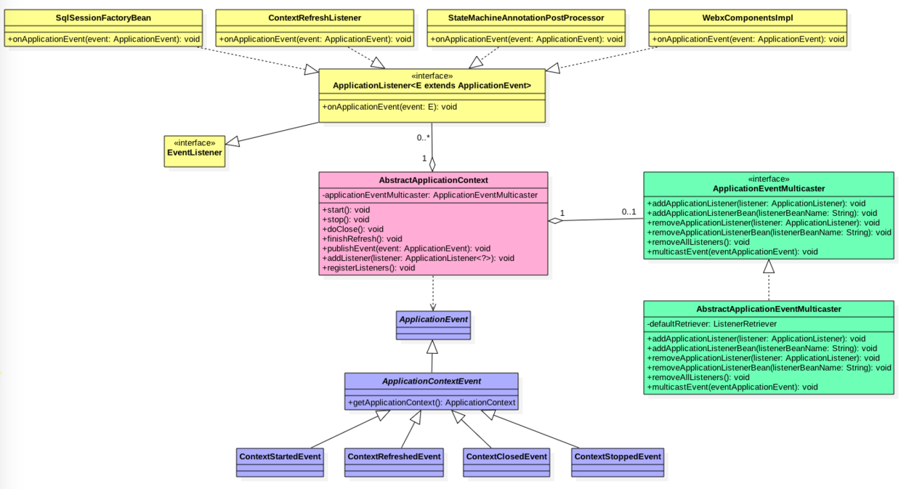

如图 黄色部分的 `listener` 们可以认为是订阅者，红色的 `context` 是发布者，`context` 在 `IOC` 不同状态会给这些订阅者发布不同的消息通知订阅者容器状态。蓝色的为具体的事件（这里为容器不同状态），其中 `ContextRefreshedEvent` 是 `IOC` 刷新完成（也就是 `bean` 解析完成，创建完毕并且 `autowired` 完成）后的事件这个经常用。 。这里 `context` 并不是直接来管理黄色的 `listener` 订阅者的，而是委托给了绿色的部分，该部分是可以增加删除订阅者，并且发布事件给订阅者。

其实 Tomcat 中的 `Lifecycle` 也是这种机制

### 使用场景

满足发布-订阅条件的，当一个对象状态或者属性变化，需要把这种变化通知到订阅者时候。

## 十三、命令模式（Command Pattern）

### 介绍

命令模式是一种行为模式，通过把命令封装为一个对象，命令发送者把命令对象发出后，就不去管是谁来接受处理这个命令，命令接受者接受到命令对象后进行处理，也不用管命令是谁发出的，所以命令模式实现了发送者与接受者之间的解耦，而具体把命令发送给谁还需要一个控制器。

### Tomcat 中命令模式

Tomcat 作为一个服务器本身会接受外部大量请求，当一个请求过来后 Tomcat 根据域名去找对应的 host,找到 host 后会根据应用名去找具体的 context(应用)，然后具体应用处理请求。对于具体 host 来说他不关心这个请求是谁给的，对应请求来说他不必关心谁来处理，但是两者是通过 request 封装请求对象进行关联起来。

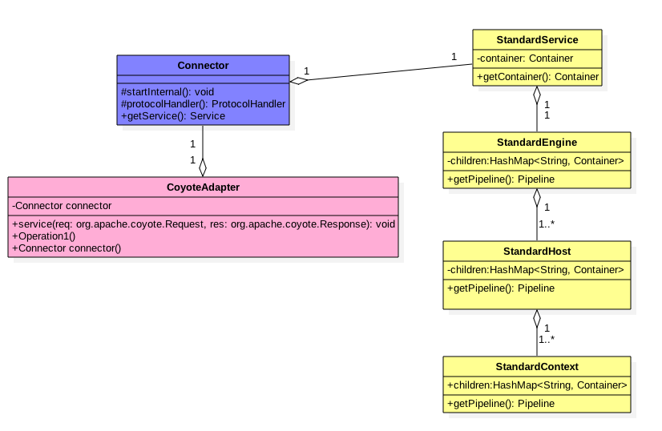

Tomcat 中 `Connector` 作为命令发出者，`Connector` 接受到请求后把请求内容封装为 `request` 对象（命令对象），然后使用 `CoyoteAdapter` 作为分发器把请求具体发配到具体的 `host`, `host` 在根据 `request` 对象找到具体的 `context`,至此找到了具体的应用，交给具体应用处理。

另外对于使用 SpringMVC 的应用来说，上面找到具体应用，但是具体交给那个 controller 来处理那，这是不是也是命令模式的使用那。

### 使用场景

当事件发送者和接受者直接需要完全解耦（直接并不存在引用关系）时候。

## 总结

设计模式中每一个模式都描述了在我们工作中不断重复发生的问题，以及问题的解决方案，所以真正掌握设计模式可以避免我们做不必要的重复劳动。