# 你如何对需求原型进行理解和拆分

某公司的产品面试，面试前该公司让面试者做一道笔试题，笔试题目为：

> 针对以下需求提供一个解决方案：在卡牛-信用卡管家APP里面，我们的用户需要一个寻找 附近银行网点/ATM 的功能：
>
> 1. 请交付你针对这个需求，设计的 Axure 原型界面的解决方案
> 2. 在原型里面标明业务规则和你对这个需求的分析思考过程（脑图、流程图等等）

通过本道题目，将讲述为某产品添加一个功能需求，从策划到上线将会走那些流程。

在一家小型的创业公司，从项目的需求——项目的落实——项目的上线，他们大致会走这样的流程：`产品策划` – `UI设计` – `研发评审` – `测试评审` – `研发阶段` – `测试阶段` – `上线`。结合那个面试题，详细的讲述产品策划这块，简要的描述一下后续几个流程。

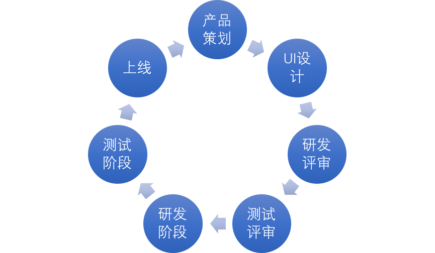

根据以上笔试题，我们可以得知：卡牛-信用卡管家 APP 的用户反馈得知，用户希望在卡牛 APP 有一个可以寻找 附近银行网点／ATM的功能。

## 产品策划

在产品策划中，首先是获取产品需求、然后对产品需求进行筛选、评估。获取产品需求主要来源可以分为**内部渠道和外部渠道。外部渠道的来源于“用户反馈、用户调研、竞品分析、市场、合作伙伴”；内部渠道的来源于“公司战略、产品经理本身、产品数据分析、其他部门的反馈”**。

当获取到产品需求时，接下就会进行需求评估，**需求评估将会利用以下方法：客户满意度、马斯洛需求、重要紧急四项型、调研强制排序、维度评分排序**。

**维度需求排序的话，一般的排序：企业的发展战略、产品的定位、需求价值度（企业价值、用户价值等）、核心用户占有比例、需求频率的程度等方面**。在这种情况下，一般产品部门都会把所有需求都写在需求评估表中，然后对需求进行评估，如图。在创业型公司来说，大部分的需求一般都是公司战略层次的需求（正所谓老板需求）。

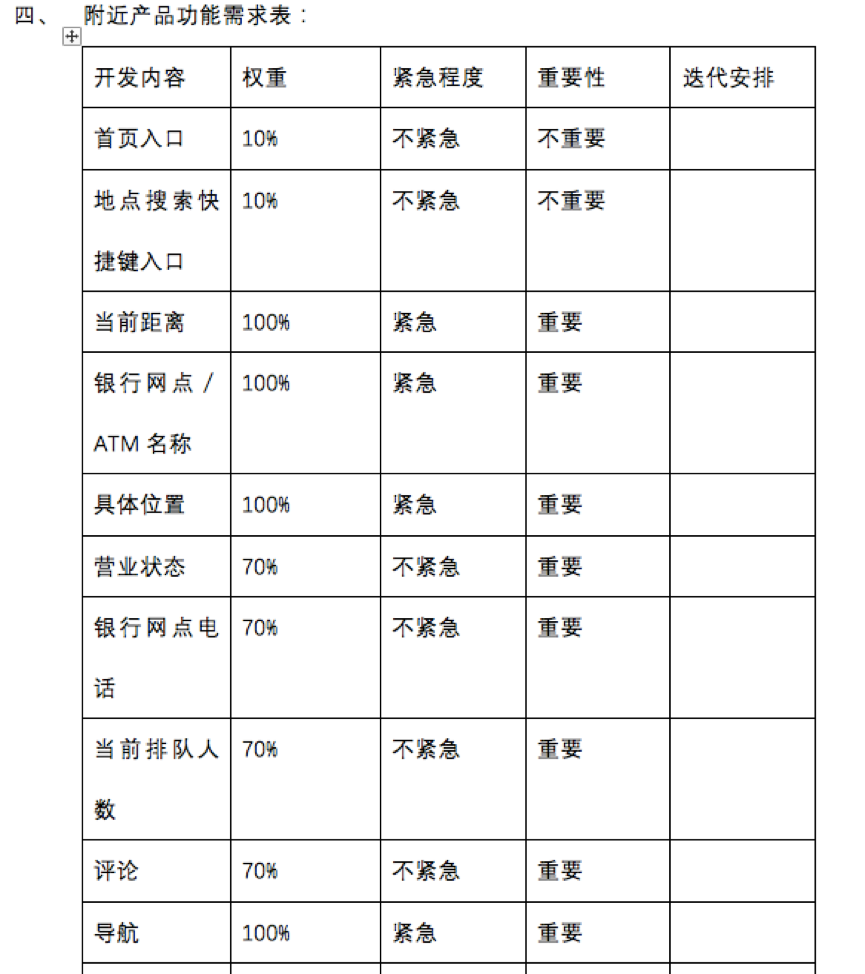

有时候在产品需求的前面，会有一次产品需求调研，这是为了进一步确认此**产品需求的必要性**。在创业型公司来说，一般都是直接省去，直接确定产品需求，然后开始落实。

当需求确定后，我们进入**产品需求功能的落实**（也就是将产品需求画出来，然后去研发）。在笔试题中已经确定了产品需求，所以我们只需要考虑产品功能如何落实。

产品功能的落实，**一般会走以下流程：竞品分析（产品功能调研）—绘制流程图—产品原型图的制作—产品部门内部评审**。

现在我们需要对卡牛 APP 中开发一个“寻找附近银行网点／ATM的功能”。

### 产品功能调研

1. 挑选竞品。几款地图 APP——百度地图、高德地图
2. 分析竞品的功能。在进行功能性调研中，我们需要探讨他们功能的入口、功能的逻辑、及他们功能有哪些值得借鉴学习的地方。
3. 创想差异化／专属特色功能。

以下调研的结果：

1. 根据卡牛产品现有的功能和框架，将入口配置“信用卡—我的”功能区域中。
2. 在附近-银行页面中，我们可以提供了银行的基本信息，包括（营业厅／ATM名称、具体地点位置、电话号码、距离）。
3. 为了增加用户黏性，可以设置“评价服务功能”，时刻了解到该银行的服务情况。
4. 开设特色服务功能，在卡牛中设置银行排队预约功能。这个功能的创想主要是来源生活中的观察和留意，大家可以回忆自己平日去银行办理业务时，都需要进行长时间的排队，而且预约的地点只能在规定的银行预约排队，整个体验下来是不是特别低效。

### 绘制流程图和原型图

在绘制流程图的过程中，团子建议大家**不要先急着绘制流程图，先用思维导图绘制一些产品功能的模块，哪些功能需要展现到那些页面，那个区域包括那些信息，理顺思路，然后绘制流程图**，如图。

画流程是一个锻炼逻辑的活，以下是我画产品功能的逻辑图，分三大块：附近主流程、评价流程、预约流程。大家可以借鉴参考一下。

#### 思维导图

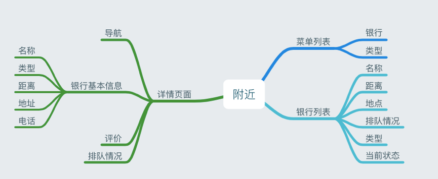

#### 主流程图——附近

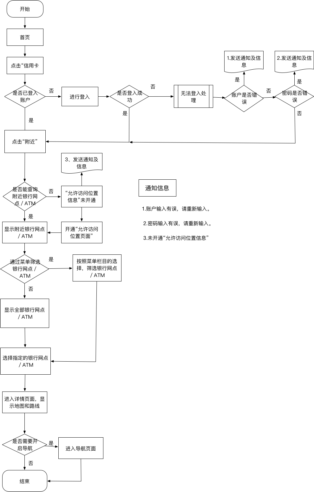

#### 流程图——评价

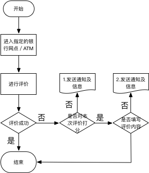

#### 流程图——预约

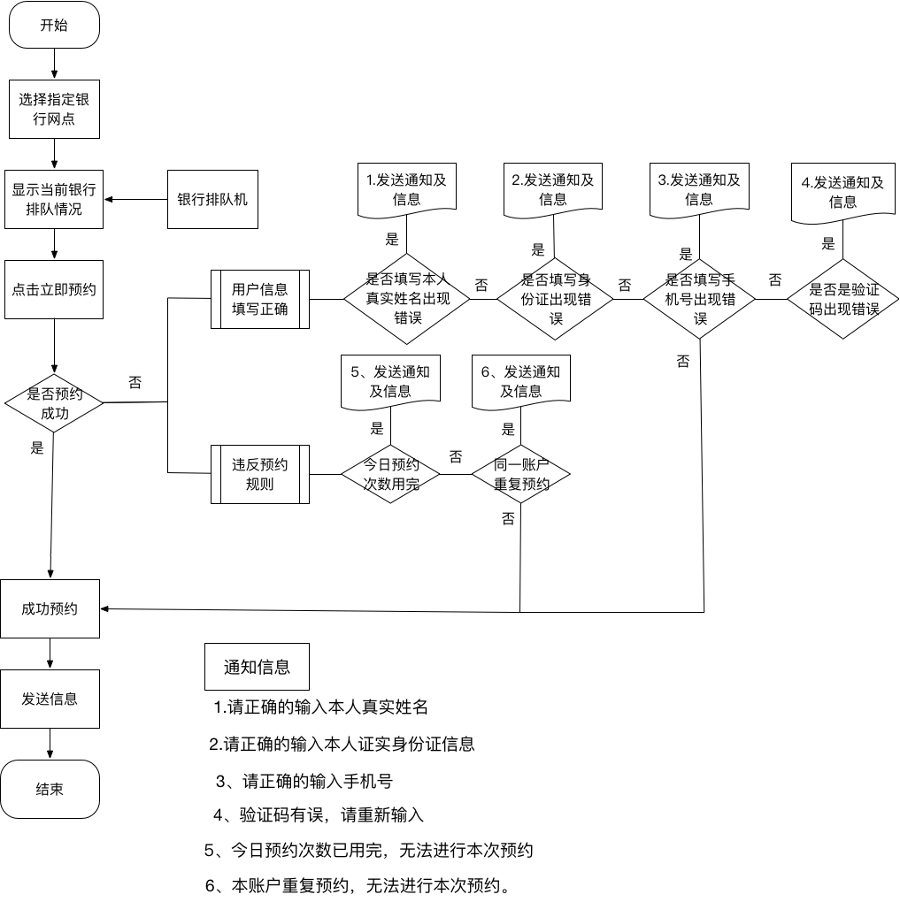

### 原型交互

在原型交互的过程中，有些公司需要你在产品原型图上做动态交互，有些公司只需要你在产品原型图上做好交互标明。对此评价一下没做交互动态和做了交互动态的优缺点。

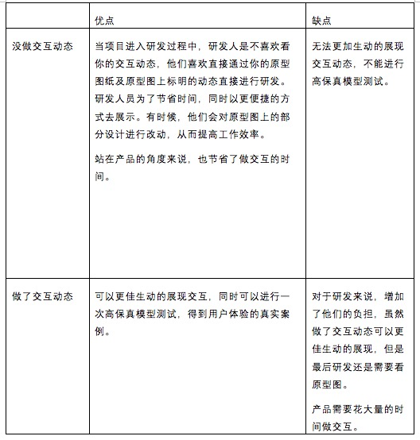

#### 整体原型图

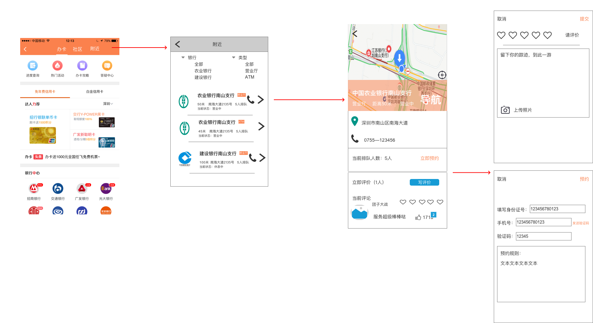

#### 交互原型图

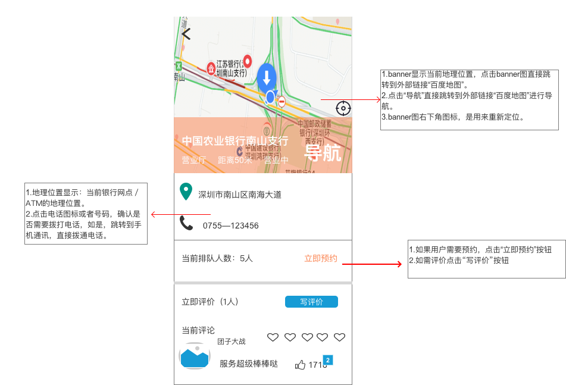

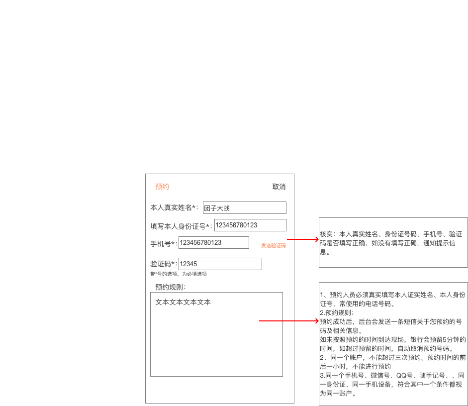

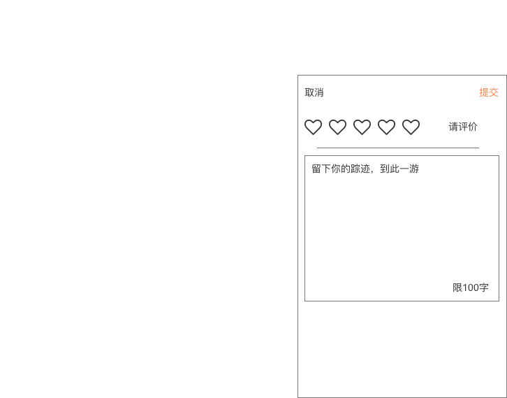

### 搜集产品部门内部意见

完成原型图的绘制，产品策划也就完成了 90% 的工作，随后就是产品部门的审核，这一项工作将会召集产品部、运营部、UI部门进行讨论和点评，对产品原型图进行进一步优化，此刻你需要搜集其他同事及其他部门的意见，然后收集回来进行整理，筛选出可以优化的需求。

## UI设计

当面对一般 UI 时，如果你对一般的 UI 说“我需要你帮我设计一款简洁、大气、稳重严肃、不需要太多的色彩的页面”，此时 UI 会一面懵逼，他会反问你一句：“你到告诉我啥叫简洁、大气、稳重严肃”。

面对公司这样的 UI 时，**最好的解决方式就是自己去找素材，然后找到你喜欢的素材发给 UI**，对着 UI 说“我就要这种风格”。此时 UI 就不会怼你，他就会照着这个做。

## 研发评审

完成以上工作流程之后，在此就会召开研发测试需求评审，这块主要是对此**需求进行排期和了解制作此需求所需要花的时间、此产品需求的可用性**。

作为产品狗，需要了解目前整个产品的大致动态和产品后期迭代的内容，对此该功能应放在那期迭代中。了解研发部门的情况，确定了研发的时间。

## 测试评审

接下来到了测试评审，在研发中这是一个很重要的环节，需要对**理想期的产品原型图测试和规划**，等到时候研发开发完成了后，需要测试部门进行测试，测试部门会对照理想型的产品图与测试版产品进行比较，写下测试日志文档，为后期的产品功能迭代做好铺垫和准备。因此测试人员会在前期与产品人员进行一次详细的讨论，关于产品原型图的事项，在讨论的过程中**需要对每一个细节和动态进行说明**，所以产品在此要多和测试交流沟通，时刻传达信息给测试人员，做好同步信息。

## 研发阶段

在产品研发过程中，测试和研发是一起进行的。有时候研发要改动产品原型图的需求，研发首先会通知产品，他们要对需求进行改动，一般的改动大概就是“**砍需求、改动态（为什么研发不喜欢看高保证原型）**”，所以产品需要对改动的需求进行快速决策。研发这边改需求，此时产品就要和测试那边沟通，将信息传达给测试。**工作信息要进行时刻同步**。

## 测试阶段

当研发完成初稿后，会提交转测邮件，测试部门会接收此文档进行测试，如有问题，就会将产品测试的 BUG 进行整理，让研发继续修补 BUG，研发修好后，在会进行转测，直到可以上线为止。如果功能越复杂，一般会走好几个来回。

有人会问，为什么要在研发测试的过程中，平凡发邮件。其实这样是为了进行**权责分明**，同时可以进行工作上的同步。

## 上线

当测试完成后就到了，负责人就要对产品进行申请，发布提交上线邮件将公布给全公司，然后完成了产品的上线。此时是产品狗最幸福的时刻。