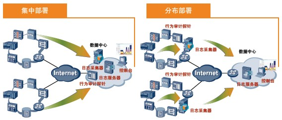
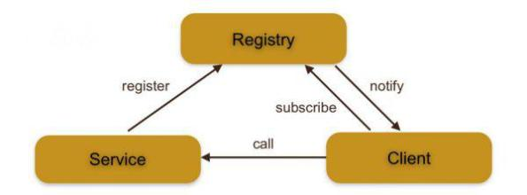

# 你如何考虑服务化

## 集中式与分布式

要谈微服务，那么必须建立在分布式的基础上，对于一个集中式系统也无需谈微服务。



### 集中式

集中式系统用一句话概括就是：一个主机带多个终端。终端没有数据处理能力，仅负责数据的录入和输出。而运算、存储等全部在主机上进行。

集中式系统的最大的特点就是部署结构非常简单，底层一般采用从IBM、HP等厂商购买到的昂贵的大型主机。因此无需考虑如何对服务进行多节点的部署，也就不用考虑各节点之间的分布式协作问题。但是，由于采用单机部署。很可能带来系统大而复杂、难于维护、发生单点故障（单个点发生故障的时候会波及到整个系统或者网络，从而导致整个系统或者网络的瘫痪）、扩展性差等问题。

### 分布式

分布式就是一群独立计算机集合共同对外提供服务，但是对于系统的用户来说，就像是一台计算机在提供服务一样。分布式意味着可以采用更多的普通计算机（相对于昂贵的大型机）组成分布式集群对外提供服务。计算机越多，CPU、内存、存储资源等也就越多，能够处理的并发访问量也就越大。

拿电商网站来说，我们一般把一个电商网站横向拆分成商品模块、订单模块、购物车模块、消息模块、支付模块等。然后我们把不同的模块部署到不同的机器上，各个模块之间通过远程服务调用(`RPC`)等方式进行通信。以一个分布式的系统对外提供服务。

## 服务化

提到分布式，一个不得不提的词就是服务化，服务化架构使搭建分布式系统成为了可能。

传统的软件开发面临着很多的问题，比如： 代码重复率高、代码庞大难以维护、无法快速迭代、测试成本高、可伸缩性差、可靠性差、模块间高度依赖。为了解决上面这些问题，我们一般采用拆分、解耦、分层、独立等方式来解决。有了服务化架构，我们就可以在很大程度上解决这些问题。

> 服务化是一种粗粒度、松耦合的以服务为中心的架构，服务之间通过定义明确的协议和接口进行通信。

这里说到的“服务”，本质上来说，就是指“RPC”。单纯的RPC功能实现，其实很简单，无非就是client发起调用，中间某个组件（甚至就是client本身）拦截调用信息，序列化后将信息传输到server端，server端收到调用请求后反序列化，根据请求详细发起实际调用后返回响应传输回给client端。这样的RPC很常见，比如常见的存储过程调用就是一例。但是在一个复杂的业务环境，如何管理和协同这些大量的RPC才是最麻烦的事情。所以，一般提到的“服务化”更多指的是对RPC的管理。服务化一般关注服务注册，服务协调，服务可用性，服务通讯协议和内容交换等。



## 面向服务的架构

面向服务架构（Service-Oriented Architecture，`SOA`）又称“面向服务的体系结构”，是Gartner于2O世纪9O年代中期提出的面向服务架构的概念。

> 面向服务架构，从语义上说，它与面向过程、面向对象、面向组件一样，是一种软件组建及开发的方式。与以往的软件开发、架构模式一样，SOA 只是一种体系、一种思想，而不是某种具体的软件产品。


这里，我们通过一个例子来解释一下到底什么是 SOA？如何做到 SOA？

### 什么是 SOA

SOA 也可以说是一种是设计原则（模式），那么它包含哪些内容呢？事实上，这方面并没有最标准的答案，多数是遵从著名 SOA 专家 Thomas Erl 的归纳：

- 标准化的服务契约 Standardized service contract
- 服务的松耦合 Service loose coupling
- 服务的抽象 Service abstraction
- 服务的可重用性 Service reusability
- 服务的自治性 Service autonomy
- 服务的无状态性 Service statelessness
- 服务的可发现性 Service discoverability
- 服务的可组合性 Service composability

这些原则总的来说要达到的目的是：提高软件的重用性，减少开发和维护的成本，最终增加一个公司业务的敏捷度。既然是面向服务的架构，那么我们就先来定义一个服务，

```text
public interface Echo {
    String echo(String text);
}

public class EchoImpl implements Echo {
    public String echo(String text) {
        return text;
    }
}
```

上面这段代码相信有过 JavaWeb 开发经验的人都不会陌生。就是定义了一个服务的接口和实现。

那么，定义了服务，我们就做到了 SOA 了么？

我们用 Thomas Erl 定义的原则来对比一下，用松耦合和可重用这几个原则来尝试分析一下上面 Echo 示例：

- Echo 的服务契约是用 Java 接口定义，而不是一种与平台和语言无关的标准化协议，如 WSDL，CORBA IDL。当然可以抬杠，Java 也是行业标准，甚至全国牙防组一致认定的东西也是行业标准。
- Java 接口大大加重了与 Service 客户端的耦合度，即要求客户端必须也是 Java，或者 JVM 上的动态语言（如Groovy、Jython）等等……
- 同时，Echo 是一个 Java 的本地接口，就要求调用者最好在同一个 JVM 进程之内……
- Echo 的业务逻辑虽然简单独立，但以上技术方面的局限就导致它无法以后在其他场合被轻易重用，比如分布式环境，异构平台等等 ESB 是 SCA 思想实现的基础设施。ESB 主要作用是集中注册发布服务，为服务与传输协议之间解耦。并不是所有的 SOA 架构都需要 ESB，ESB 是 SCA 特有的。当然任何符合 ESB 特征的解决方式都可以称之为 ESB，也不仅仅是 SCA 内部的。

因此，我们可以认为 Echo 并不太符合 SOA 的基本设计原则。

### 实现 SOA

修改一下上面的 Echo，添加 Java EE 的 `@WebServices` 注解

```text
@WebServices
public class EchoImpl implements Echo {
    public String echo(String text) {
        return text;
    }
}
```

现在将 Echo 发布为 Java WebServices，并由底层框架自动生成 WSDL 来作为标准化的服务契约，这样就能与远程的各种语言和平台互操作了，较好的解决了上面提到的松耦合和可重用的问题。按照一般的理解，Echo 似乎就成为比较理想的 SOA service了。

使用 WebServices 只是一种相对简单的方案，SOA 的最常见的解决方案是 SCA，其次还有 JBI，BPEL 等。ESB 是 SCA 思想实现的基础设施。ESB 主要作用是集中注册发布服务，为服务与传输协议之间解耦。关于 SCA 和 ESB 并不是本文的重点，感兴趣的朋友可以从网络上获取更多资料。(可以从上图中看到 ESB 在整个 SOA 架构中所扮演的角色)

## 面向对象和面向服务的对比

面向对象（`OO`）和面向服务（`SO`）在基础理念上有大量共通之处，比如都尽可能追求抽象、封装和低耦合。

但 SO 相对于 OO，又有非常不同的典型应用场景，比如：

- 多数 OO 接口（interface）都只被有限的人使用（比如团队和部门内），而 SO 接口（或者叫契约）一般来说都不应该对使用者的范围作出太多的限定和假设（可以是不同部门，不同企业，不同国家）。还记得贝佐斯原则吗？“团队必须做好规划与设计，以便未来把接口开放给全世界的程序员，没有任何例外”。
- 多数 OO 接口都只在进程内被访问，而 SO 接口通常都是被远程调用。

简单讲，就是 SO 接口使用范围比一般 OO 接口可能广泛得多。我们用网站打个比方：一个大型网站的 web 界面就是它整个系统入口点和边界，可能要面对全世界的访问者（所以经常会做国际化之类的工作），而系统内部传统的 OO 接口和程序则被隐藏在 web 界面之后，只被内部较小范围使用。而理想的 SO 接口和 web 界面一样，也是变成系统入口和边界，可能要对全世界开发者开放，因此 SO 在设计开发之中与 OO 相比其实会有很多不同。

## 微服务架构

微服务架构(`MicroService`)是一种服务化架构风格，通过将功能分散到各个离散的服务中以实现对解决方案的解耦。微服务架构强调的第一个重点就是业务系统需要彻底的组件化和服务化（这也是我们为什么要先介绍组件化和服务化的原因）。微服务的诞生并非偶然。它是互联网高速发展，敏捷、精益、持续交付方法论的深入人心，虚拟化技术与 DevOps 文化的快速发展以及传统单块架构无法适应快速变化等多重因素的推动下所诞生的产物。

微服务的流行，Martin 功不可没，先看看他是如何定义微服务的：

- 一些列的独立的服务共同组成系统
- 单独部署，跑在自己的进程里
- 每个服务为独立的业务开发
- 分布式的管理

Martin 自己也说了，每个人对微服务都可以有自己的理解，不过大概的标准还是有一些的。

- 分布式服务组成的系统
- 按照业务而不是技术来划分组织
- 做有生命的产品而不是项目
- Smart endpoints and dumb pipes（我的理解是强服务个体和弱通信）
- 自动化运维（DevOps）
- 容错
- 快速演化

## SOA 和微服务

看了 SOA 和微服务，很多人会认为这不就是一回事儿么。其实 SOA 和微服务就是差不多的。

- SOA 关注的是服务重用，微服务在关注服务重用的同时，也同时关注快速交付；
- 微服务不再强调传统 SOA 架构里面比较重的 ESB 企业服务总线。微服务把所有的“思考”逻辑包括路由、消息解析等放在服务内部，去掉一个大一统的 ESB，服务间轻通信，是比 SOA 更彻底的拆分。