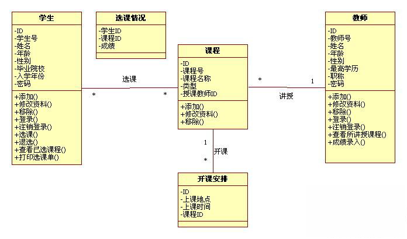

# 说说你在项目中使用过的 UML 图

## 前言

在 OOA 与 OOD 大行其道的今天，UML 在系统分析与设计中得到了广泛的采用。而在 UML 的 9 种图中，类图是最重要也是使用最普遍的图之一。但是，在与一些朋友，特别是初学者的聊天当中，我发现很多朋友对类图的作用及使用方法存在一定的误解和困惑。希望本文能在一定程度上帮助这些朋友更好的认识和使用类图。

## A vs D

要想正确认识与使用类图，我们首先要正确认识两个概念——“A”和“D”。

A是Analyse的缩写，即我们所说的“分析”；而D是Design的缩写，即“设计”。一般来说，一个系统在编码前，都要经过分析与设计两个步骤。而对这两个概念认识的模糊不清，正是导致很多朋友无法正确使用类图的原因。

分析，我对其的解释是：根据用户的需求，做出一系列与业务领域相关而和计算机技术无关的整理与识别。

很多朋友有个错误的认识，认为软件开发工作一定要由懂计算机的人完成，不懂计算机的人怎么能进行软件开发呢？当然，对于设计和编码等工作，当然是这样，但是唯有“分析”这一工作，可以由完全不懂计算机的人来进行，甚至从某种程度上说，不懂计算机的人更适合做软件分析师的工作。因为想要把分析做好，一定要仅与业务相关，而抛开具体技术。一个满脑子计算机技术的程序员去做分析时，很容易想到编码、实现、平台、数据库设计等具体细节，这种思维形式恰恰成为做好分析的最大障碍。此为误解一：只有懂计算机技术的人才能做系统分析师。我现在所在的研究所（北京航空航天大学计算机学院软件工程研究所）曾经接过一个日本项目，当时日方那边派来一个系统分析师对计算机就完全是外行，而是一个领域专家，但是他很好的完成了系统分析的工作。

另外一个误解就是UML图，特别是类图，就是给开发人员用的。很多人觉得UML是计算机业内专业语言，不懂计算机的怎么能用它呢？用了做什么呢？但是很多不懂计算机的系统分析师在进行分析工作时，也在使用UML图，而类图就是其中一种。一般情况下，分析师在进行分析时，确实会绘制一套类图。但是，它所画的类图不管是从视角还是作用，与设计师所做的类图是不同的，具体将在下面介绍。此为误解二：只有计算机人士才使用UML图。

分析说完了，下面说设计。与分析不同，我对设计的解释是：根据分析材料与技术平台，确定软件系统的架构结构、编码方式及一切与具体技术有关的宏观问题。

这里可以看到，设计与分析不同，它必须由计算机方面的人来完成，因为它和具体技术是息息相关的。而且，设计师在进行设计时，也会绘制一套类图。

到这里，我们明确了，原来软件在分析与设计两个阶段各自会绘制一套类图，而且是由分析师和设计师两个不同的角色绘制的。那么这两套类图有什么异同呢？下面将解释这个问题。

## 领域类图 vs 实现类图

上文提到，在软件分析与设计过程中，会由两种角色产生两套类图。一般情况下，分析师绘制的类图叫做“领域类图”，而设计师绘制的类图叫做“实现类图”。这里要声明，这两个名词是我的习惯性叫法，并不是大家都认同的通用叫法。下面，我对这两种类图给出我的定义：

领域类图：产生于分析阶段，由系统分析师绘制，主要作用是描述业务实体的静态结构，包括业务实体、各个业务实体所具有的业务属性及业务操作、业务实体之间具有的关系。

虽然这个类图也叫“类图”，但是说实话，它和编程中的“类”实在是没啥关系，因为最后的系统中可能根本没有类和它们对应，而且很多最后系统中的类如控制类和界面类这套类图中也没有。也就是说这套图和具体技术无关，也不是画给程序员看的，它只是表达业务领域中的一个静态结构。下面给个例子：

这是一个选课系统的简单领域分析类图。可以看到，主要实体有教师、学生、课程和开课安排。每个实体标注了其在业务上具有的属性和方法。而且图中还标明了实体间的关系。

但是，最终系统中可能没有一个学生类和其对应。因为最终系统中有哪些类、各个类有什么属性、方法依赖于所选择的平台和架构。例如，如果使用了 Struts2，则会存在很多 Action 类，而使用了 [ASP.NET](https://www.funtl.com/zh/interview/ASP.NET) MVC，则会有很多 Controller 类等，所以，领域类图只于业务有关，和具体实现及编码等计算机技术无关。

**下面该说说实现类图了：**

现类图：产生于设计阶段，由系统设计师绘制，其作用是描述系统的架构结构、指导程序员编码。它包括系统中所有有必要指明的实体类、控制类、界面类及与具体平台有关的所有技术性信息。

就像上面的领域类图，如果你把它交给程序员编码，我想程序员会疯掉，因为它没有提供任何编码的依据。假如我们使用的是.NET平台分层架构，并使用ASP.NET MVC，则设计师应该在实现类图中绘制出所有的实体类、数据访问类、业务逻辑类和界面类，界面类又分为视图类、控制器类等等，还要表示出IoC和Aop等信息，并明确指出各个类的属性、方法，不能有遗漏，因为最终程序员实现程序的依据就是实现类图。

## 总结

最后，我们总结一下本文的要点：

1. 软件分析与设计是编码前的两个阶段，其中分析仅与业务有关，而与技术无关。设计以分析为基础，主要与具体技术有关。
2. 分析阶段由分析师绘制领域类图，设计阶段由设计师绘制实现类图。
3. 领域类图表示系统的静态领域结构，其中的类不与最终程序中的类对应；设计类图表示系统的技术架构，是程序员的编码依据，其中的类与系统中的类对应。
4. 领域类图中类的属性与操作仅关注与业务相关的部分，实现类图中的属性与操作要包括最终需要实现的全部方法与操作。